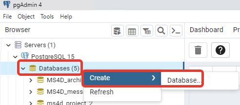
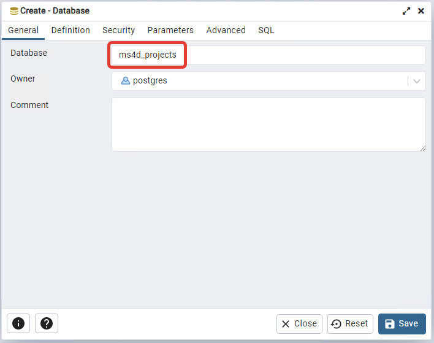
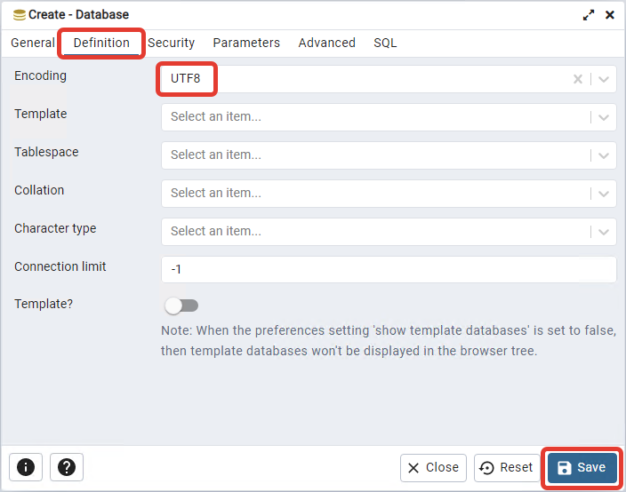
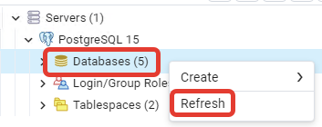
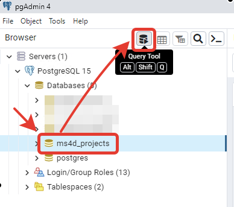
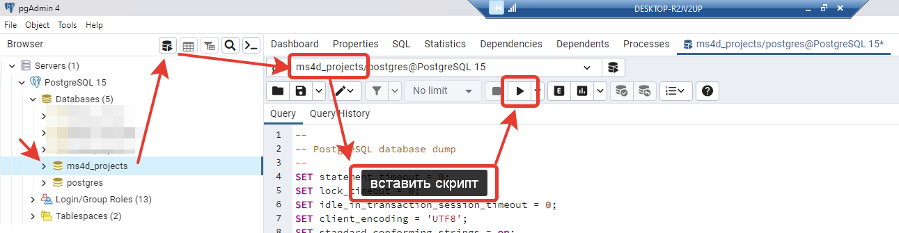

# Восстановление базы данных - ms4d_projects

- [Когда это может понадобится?](#%D0%9A%D0%BE%D0%B3%D0%B4%D0%B0-%D1%8D%D1%82%D0%BE-%D0%BC%D0%BE%D0%B6%D0%B5%D1%82-%D0%BF%D0%BE%D0%BD%D0%B0%D0%B4%D0%BE%D0%B1%D0%B8%D1%82%D1%81%D1%8F)
- [Создание пустой базы](#%D0%A1%D0%BE%D0%B7%D0%B4%D0%B0%D0%BD%D0%B8%D0%B5-%D0%BF%D1%83%D1%81%D1%82%D0%BE%D0%B9-%D0%B1%D0%B0%D0%B7%D1%8B)
	- [Создание пустой базы через графический интерфейс](#%D0%A1%D0%BE%D0%B7%D0%B4%D0%B0%D0%BD%D0%B8%D0%B5-%D0%BF%D1%83%D1%81%D1%82%D0%BE%D0%B9-%D0%B1%D0%B0%D0%B7%D1%8B-%D1%87%D0%B5%D1%80%D0%B5%D0%B7-%D0%B3%D1%80%D0%B0%D1%84%D0%B8%D1%87%D0%B5%D1%81%D0%BA%D0%B8%D0%B9-%D0%B8%D0%BD%D1%82%D0%B5%D1%80%D1%84%D0%B5%D0%B9%D1%81)
	- [Создание пустой базы с помощью SQL скрипта](#%D0%A1%D0%BE%D0%B7%D0%B4%D0%B0%D0%BD%D0%B8%D0%B5-%D0%BF%D1%83%D1%81%D1%82%D0%BE%D0%B9-%D0%B1%D0%B0%D0%B7%D1%8B-%D1%81-%D0%BF%D0%BE%D0%BC%D0%BE%D1%89%D1%8C%D1%8E-sql-%D1%81%D0%BA%D1%80%D0%B8%D0%BF%D1%82%D0%B0)
- [Восстановление структуры базы данных](#%D0%92%D0%BE%D1%81%D1%81%D1%82%D0%B0%D0%BD%D0%BE%D0%B2%D0%BB%D0%B5%D0%BD%D0%B8%D0%B5-%D1%81%D1%82%D1%80%D1%83%D0%BA%D1%82%D1%83%D1%80%D1%8B-%D0%B1%D0%B0%D0%B7%D1%8B-%D0%B4%D0%B0%D0%BD%D0%BD%D1%8B%D1%85)
- [Пример базы](#%D0%9F%D1%80%D0%B8%D0%BC%D0%B5%D1%80-%D0%B1%D0%B0%D0%B7%D1%8B)

## Когда это может понадобится?

Если в **PostgreSQL** случайно удалили базу данных **ms4d_projects**.

## Создание пустой базы

### Создание пустой базы через графический интерфейс

В **PostgreSQL** создайте пустую базу данных **ms4d_projects** с настройками по умолчанию. Для этого нажмите **ПКМ** по **Databases** и выберите **Create** - **Database**.



На вкладке **General** в поле **Database** введите название базы **ms4d_projects**.



На вкладке **Definition** убедитесь, что в поле **Encoding** выбрана кодировка **UTF8**.

Затем нажмите **Save**.



Чтобы база появилась в списке **Databases** необходимо нажать ПКМ по данному пункту и выбрать **Refresh**. Альтернативный вариант, это полностью свернуть дерево, а затем развернуть.



### Создание пустой базы с помощью SQL скрипта

Это создание базы, но только скриптом SQL.

```sql
CREATE DATABASE ms4d_projects
    WITH
    OWNER = postgres
    ENCODING = 'UTF8'
    CONNECTION LIMIT = -1
    IS_TEMPLATE = False;
```

## Восстановление структуры базы данных

Обязательно выберите созданную базу **ms4d_projects**, а затем нажмите на иконку **Query Tool** для запуска редактора скриптов.



Вставьте скрипт ниже в редактор и нажмите кнопку **Execute**.

Прежде, чем выполнять скрипт убедитесь, что вы находитесь в базе **ms4d_projects**.



Из данного скрипта удалены записи касательно наполнения таблицы **projects**.

```sql
---
-- PostgreSQL database dump
--
SET statement_timeout = 0;
SET lock_timeout = 0;
SET idle_in_transaction_session_timeout = 0;
SET client_encoding = 'UTF8';
SET standard_conforming_strings = on;
SELECT pg_catalog.set_config('search_path', '', false);
SET check_function_bodies = false;
SET xmloption = content;
SET client_min_messages = warning;
SET row_security = off;
SET default_tablespace = '';
SET default_table_access_method = heap;

--
-- Name: projects; Type: TABLE; Schema: public; Owner: postgres
--
CREATE TABLE public.projects (
    project_id integer NOT NULL,
    project_name text NOT NULL,
    type_name text NOT NULL,
    config_name text NOT NULL,
    version text NOT NULL,
    changed_time timestamp without time zone NOT NULL
);
ALTER TABLE public.projects OWNER TO postgres;

--
-- Data for Name: projects; Type: TABLE DATA; Schema: public; Owner: postgres
--
-- ТУТ БЫЛО НАПОЛНЕНИЕ ТАБЛИЦЫ projects
-- см. строки COPY public.projects (project_id, ....

--
-- Name: projects pk_projects; Type: CONSTRAINT; Schema: public; Owner: postgres
--
ALTER TABLE ONLY public.projects
    ADD CONSTRAINT pk_projects PRIMARY KEY (project_id);

```

## Пример базы

Пример предоставлен для общего представления. 
