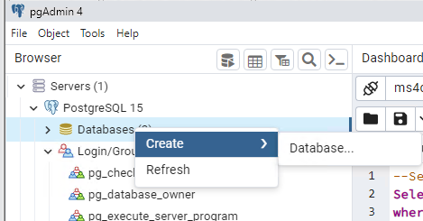
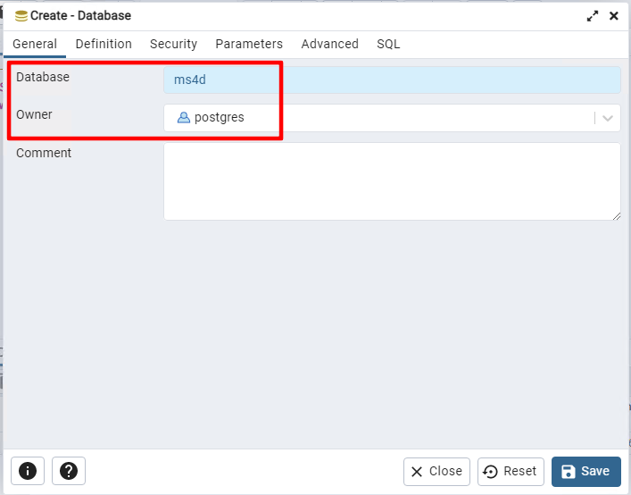
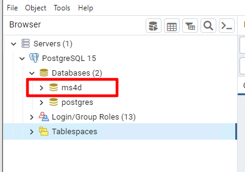
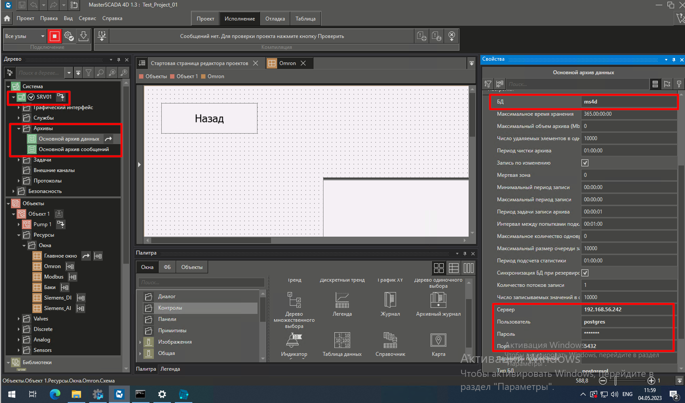
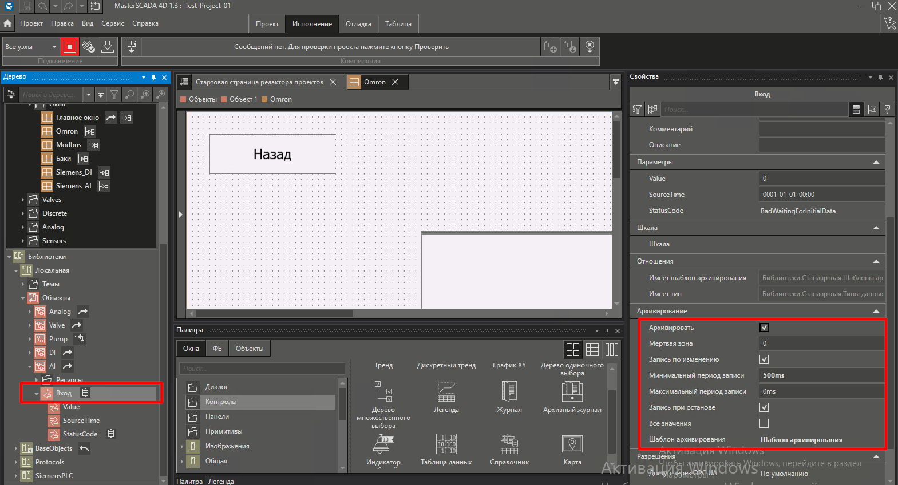
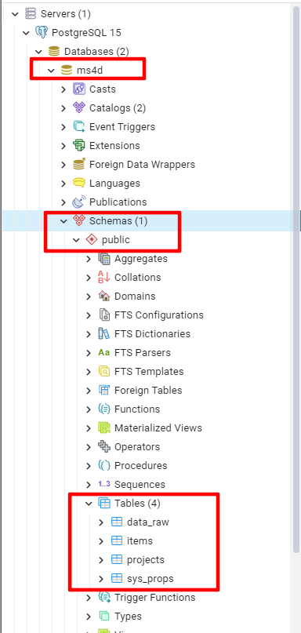
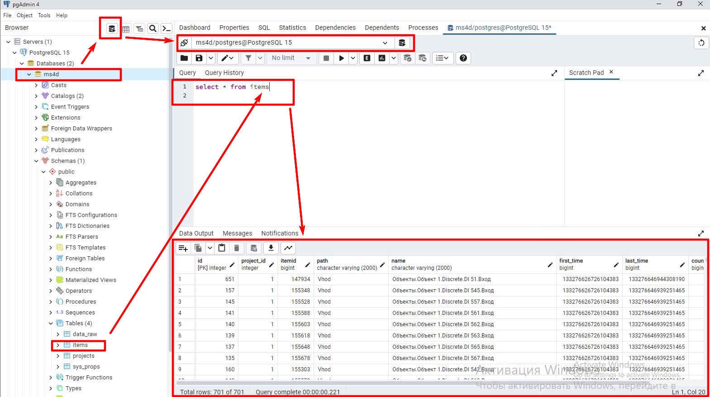
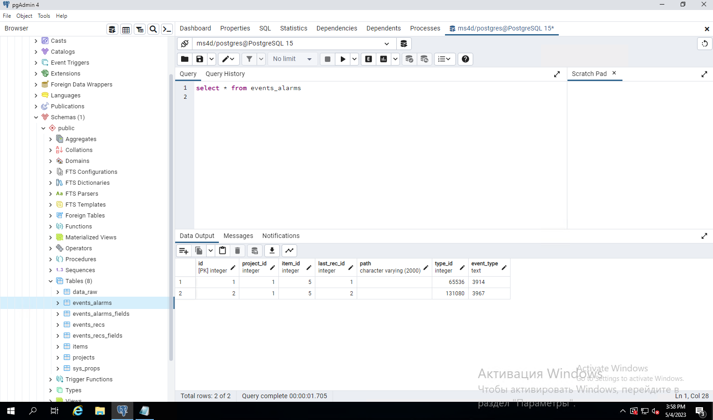

# Настройка архивов БД в PostgreSQL и MasterScada 4D

>[!error] Заметку требуется переписать, т.к. лучше использовать для трендов одну БД, а для сообщений другую. 

- [Создание пустой базы данных в PostgreSQL](#%D0%A1%D0%BE%D0%B7%D0%B4%D0%B0%D0%BD%D0%B8%D0%B5-%D0%BF%D1%83%D1%81%D1%82%D0%BE%D0%B9-%D0%B1%D0%B0%D0%B7%D1%8B-%D0%B4%D0%B0%D0%BD%D0%BD%D1%8B%D1%85-%D0%B2-postgresql)
- [Настройка архивов](#%D0%9D%D0%B0%D1%81%D1%82%D1%80%D0%BE%D0%B9%D0%BA%D0%B0-%D0%B0%D1%80%D1%85%D0%B8%D0%B2%D0%BE%D0%B2)
- [Настройка архивации параметра](#%D0%9D%D0%B0%D1%81%D1%82%D1%80%D0%BE%D0%B9%D0%BA%D0%B0-%D0%B0%D1%80%D1%85%D0%B8%D0%B2%D0%B0%D1%86%D0%B8%D0%B8-%D0%BF%D0%B0%D1%80%D0%B0%D0%BC%D0%B5%D1%82%D1%80%D0%B0)
- [Проверка созданных таблиц в postgresql](#%D0%9F%D1%80%D0%BE%D0%B2%D0%B5%D1%80%D0%BA%D0%B0-%D1%81%D0%BE%D0%B7%D0%B4%D0%B0%D0%BD%D0%BD%D1%8B%D1%85-%D1%82%D0%B0%D0%B1%D0%BB%D0%B8%D1%86-%D0%B2-postgresql)
- [Источник](#%D0%98%D1%81%D1%82%D0%BE%D1%87%D0%BD%D0%B8%D0%BA)

Для архивов **Основной архив данных** и **Основной архив сообщений** создайте отдельные базы данных, чтобы не смешивать информацию в базах. Например:

- для архивов данных (трендов) - **ms4d_trends**; 
- для архив сообщений - **ms4d_events**.

>[!warning] В примерах ниже будет создана только одна база данных **ms4d**. Рисунки сделаны до того, как додумался разделить базы. 

## Создание пустой базы данных в PostgreSQL

Для архивации параметров в **postgresql** предварительно нужно **создать пустую базу данных**.

В программе **pgAdmin** нажмите ПКМ по пункту **Server** - **PostgreSQL** - **Databases**.

В сплывающем окне выберите **Create** - **Database**.



В поле **Database** введите имя базы данных. Например, **ms4d**.

В списке **Owner** выберите пользователя, который будет являться владельцем базы. В моем случае пользователь **postgres**.

Нажмите кнопку **Save**.



В дереве **Server** - **PostgreSQL** - **Databases** должна появится созданная база данных.



## Настройка архивов

Откройте настройки архивов в Master Scada 4d. Для этого перейдите в **Система** - <**имя узла**> (в моем случае SRV01) - **Архивы** - **Основной архив данных** и для сообщений в **Основной архив сообщений**.



Заполните соответствующие поля.

|**Свойство**|**Рекомендация**|
|---|---|
|**БД**|Имя ранее созданной базы данных в PostgreSQL|
|**Сервер**|Указывается **IP-адрес** компьютера, на котором установлена база данных.|
|**Пользователь**|Имя пользователя, который добавлен в настройках самой базы данных.<br><br>Соответствует **LoginRole** на сервер Postgre|
|**Пароль**|Пароль пользователя, который добавлен в настройках самой базы данных|
|**Порт**|Порт **TCP IP**, который используется для передачи данных между средой исполнения и базой данных.<br><br>По умолчанию для работы с базой данных PostgreSQL используется порт **5432**|
|**Тип БД**|Выбирается база данных **PostgreSQL**|

## Настройка архивации параметра

В **свойствах** параметра установите галочку **Архивировать**. Затем укажите подходящий **Шаблон архивирования** и настройте параметры шаблона.



**Скомпилируйте** и **запустите** проект Master Scada 4D на исполнение.

## Проверка созданных таблиц в postgresql

При **первом** подключении Master Scada 4D к **базе данных** будут созданы все необходимые таблицы и другие необходимые для корректной работы элементы.

В дереве **Server** - **PostgreSQL** - **Databases** - <имя созданной базы данных> - **Schemas** - **public** - **Tables** должны появится таблицы: **data_raw**, **items**, **projects**, **sys_props**.

Структуру таблиц можно увидеть по ссылке [Структура таблиц баз данных](Структура%20таблиц%20баз%20данных.md).



Например в таблице **items** хранятся теги, которые архивируются. Это можно проверить выполнив скрипт ниже в созданной базе. Для этого **выделите <название созданной базы>**, затем нажмите кнопку **Query tool**, напишите скрипт ниже и нажмите кнопку ► (**Execute/Refresh)**.

```sql
select * from items
```

В внизу появится результат выполнения скрипта.



После создания сообщений появятся новые таблицы: **projects**, **events_alarms**, **events_alarms_field**, **events_recs**, **events_recs_fields**.

```sql
select * from events_alarms
```



## Источник

- [https://support.mps-soft.ru/Site/MasterSCADA 4D/User Guide MasterSCADA 4D.pdf](https://support.mps-soft.ru/Site/MasterSCADA%204D/User%20Guide%20MasterSCADA%204D.pdf)
- Ивко Роман.