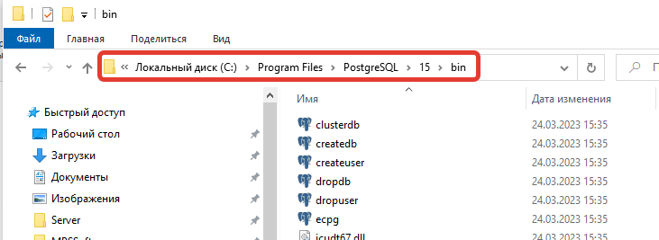
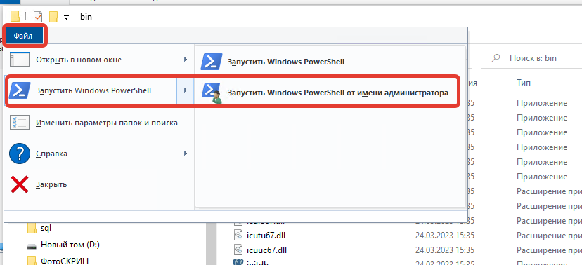
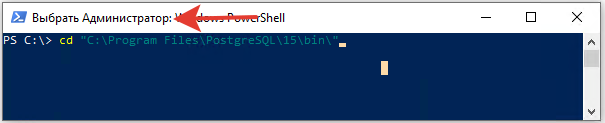
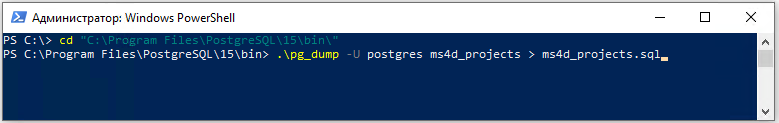
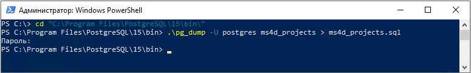
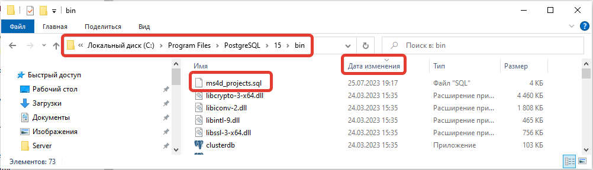

# Создание резервной копии базы данных в PostgreSQL

- [Запуск **PowerShell** от имени **Администратор**](#%D0%97%D0%B0%D0%BF%D1%83%D1%81%D0%BA-powershell-%D0%BE%D1%82-%D0%B8%D0%BC%D0%B5%D0%BD%D0%B8-%D0%90%D0%B4%D0%BC%D0%B8%D0%BD%D0%B8%D1%81%D1%82%D1%80%D0%B0%D1%82%D0%BE%D1%80)
	- [Альтернативный способ](#%D0%90%D0%BB%D1%8C%D1%82%D0%B5%D1%80%D0%BD%D0%B0%D1%82%D0%B8%D0%B2%D0%BD%D1%8B%D0%B9-%D1%81%D0%BF%D0%BE%D1%81%D0%BE%D0%B1)
- [Выполнение резервной копии](#%D0%92%D1%8B%D0%BF%D0%BE%D0%BB%D0%BD%D0%B5%D0%BD%D0%B8%D0%B5-%D1%80%D0%B5%D0%B7%D0%B5%D1%80%D0%B2%D0%BD%D0%BE%D0%B9-%D0%BA%D0%BE%D0%BF%D0%B8%D0%B8)

## Запуск **PowerShell** от имени **Администратор**

В **проводнике** перейдите в папку `C:\Program Files\PostgreSQL\15\bin\`.



Нажмите **Файл** - **Запустить Windows PowerShell** - **Запустить Windows PowerShell от имени администратора**.



### Альтернативный способ

Запустите **PowerShell** от имени **Администратор**.

Выполите команду.

```powershell
cd "C:\Program Files\PostgreSQL\15\bin\"
```



## Выполнение резервной копии

Выполните команду.

```powershell
.\pg_dump -U postgres ms4d_projects > ms4d_projects.sql
```



Введите пароль от учетной записи `postgres` и нажмите **Enter**.

>[!info] Пароль для учетной записи `postgres` задается при установке **PostgreSQL**.



Перейдите в папку `C:\Program Files\PostgreSQL\15\bin\`. В ней должна появится резервная копия базы данных.


