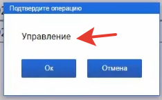
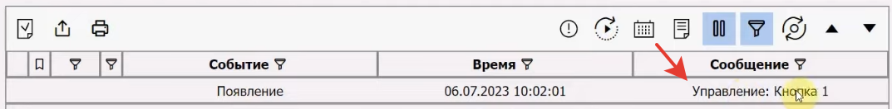
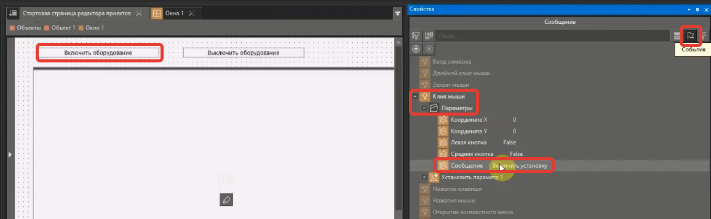
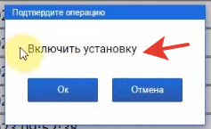
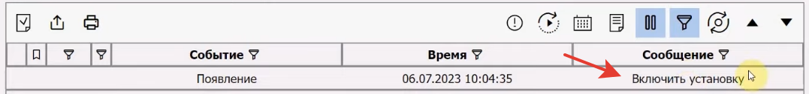

# Как изменить текст подтверждения в сплывающем окне

- [Текст по умолчанию](#%D0%A2%D0%B5%D0%BA%D1%81%D1%82-%D0%BF%D0%BE-%D1%83%D0%BC%D0%BE%D0%BB%D1%87%D0%B0%D0%BD%D0%B8%D1%8E)
- [Пользовательский текст](#%D0%9F%D0%BE%D0%BB%D1%8C%D0%B7%D0%BE%D0%B2%D0%B0%D1%82%D0%B5%D0%BB%D1%8C%D1%81%D0%BA%D0%B8%D0%B9-%D1%82%D0%B5%D0%BA%D1%81%D1%82)
- [Проверка](#%D0%9F%D1%80%D0%BE%D0%B2%D0%B5%D1%80%D0%BA%D0%B0)
- [Источник](#%D0%98%D1%81%D1%82%D0%BE%D1%87%D0%BD%D0%B8%D0%BA)

## Текст по умолчанию

## Пользовательский текст

В **событиях** кнопки в свойство **Параметры** > **Сообщение** введите свой текст.

## Проверка

## Источник

1. [https://www.youtube.com/watch?v=3ZurDrmr7A4](https://www.youtube.com/watch?v=3ZurDrmr7A4)