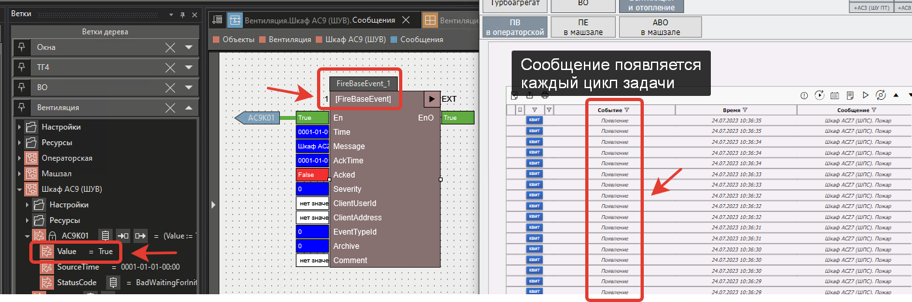
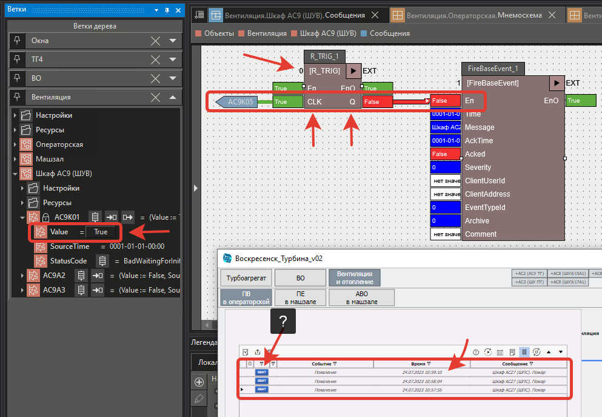
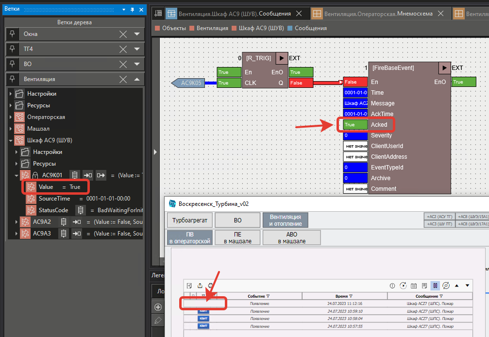

# При использовании FireBaseEvent многократно появляется одно и тоже сообщение

## Вопрос

При использовании функционального блока **FireBaseEvent** многократно появляется одно и тоже сообщение.

## Ответ

Перед вызовом блока **FireBaseEvent** необходимо вызвать блок **R_TRIG**.

>[!info] **R_TRIG** - Функциональный блок генерирует импульс по переднему фронту входного сигнала.

Однако можно заметить, что в **журнале** напротив сообщения появляется кнопка **Квит** (квитировать).

Чтобы в сообщении отключить появление кнопки **Квит**, необходимо в блоке **FireBaseEvent** вход **Acked** установить в **True**.

