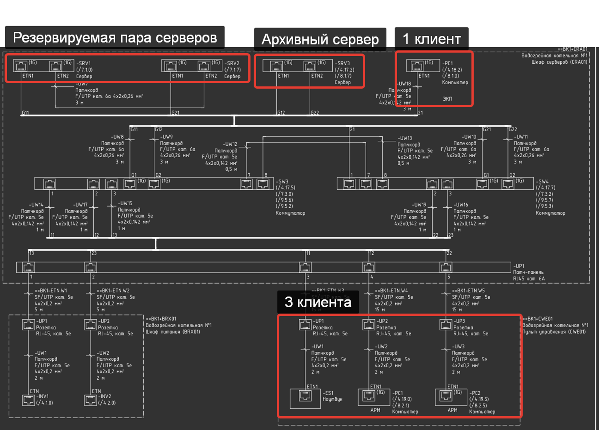

# Подбор лицензий

- [Общие сведения](#%D0%9E%D0%B1%D1%89%D0%B8%D0%B5-%D1%81%D0%B2%D0%B5%D0%B4%D0%B5%D0%BD%D0%B8%D1%8F)
- [Исполнительная система (серверная часть)](#%D0%98%D1%81%D0%BF%D0%BE%D0%BB%D0%BD%D0%B8%D1%82%D0%B5%D0%BB%D1%8C%D0%BD%D0%B0%D1%8F-%D1%81%D0%B8%D1%81%D1%82%D0%B5%D0%BC%D0%B0-%D1%81%D0%B5%D1%80%D0%B2%D0%B5%D1%80%D0%BD%D0%B0%D1%8F-%D1%87%D0%B0%D1%81%D1%82%D1%8C)
	- [Резервирование](#%D0%A0%D0%B5%D0%B7%D0%B5%D1%80%D0%B2%D0%B8%D1%80%D0%BE%D0%B2%D0%B0%D0%BD%D0%B8%D0%B5)
	- [Архивирование](#%D0%90%D1%80%D1%85%D0%B8%D0%B2%D0%B8%D1%80%D0%BE%D0%B2%D0%B0%D0%BD%D0%B8%D0%B5)
	- [Серверы ввода/вывода](#%D0%A1%D0%B5%D1%80%D0%B2%D0%B5%D1%80%D1%8B-%D0%B2%D0%B2%D0%BE%D0%B4%D0%B0%D0%B2%D1%8B%D0%B2%D0%BE%D0%B4%D0%B0)
- [Клиенты визуализации](#%D0%9A%D0%BB%D0%B8%D0%B5%D0%BD%D1%82%D1%8B-%D0%B2%D0%B8%D0%B7%D1%83%D0%B0%D0%BB%D0%B8%D0%B7%D0%B0%D1%86%D0%B8%D0%B8)
	- [Поведение клиентов при резервировании серверов](#%D0%9F%D0%BE%D0%B2%D0%B5%D0%B4%D0%B5%D0%BD%D0%B8%D0%B5-%D0%BA%D0%BB%D0%B8%D0%B5%D0%BD%D1%82%D0%BE%D0%B2-%D0%BF%D1%80%D0%B8-%D1%80%D0%B5%D0%B7%D0%B5%D1%80%D0%B2%D0%B8%D1%80%D0%BE%D0%B2%D0%B0%D0%BD%D0%B8%D0%B8-%D1%81%D0%B5%D1%80%D0%B2%D0%B5%D1%80%D0%BE%D0%B2)
- [Ключ защиты USB](#%D0%9A%D0%BB%D1%8E%D1%87-%D0%B7%D0%B0%D1%89%D0%B8%D1%82%D1%8B-usb)
- [Пример подбора](#%D0%9F%D1%80%D0%B8%D0%BC%D0%B5%D1%80-%D0%BF%D0%BE%D0%B4%D0%B1%D0%BE%D1%80%D0%B0)
- [Источники](#%D0%98%D1%81%D1%82%D0%BE%D1%87%D0%BD%D0%B8%D0%BA%D0%B8)

## Общие сведения

Среда разработки ([DT](../Глоссарий/Среда%20разработки%20(DT).md)), а также демо-версия среды исполнения ([RT](../Глоссарий/Исполнительная%20система%20(RT).md)), в которой введено одночасовое ограничение времени работы в режиме опроса периферийного оборудования и межузлового обмена, предоставляются бесплатно.

## Исполнительная система (серверная часть)

### Резервирование

>[!warning] Для каждого сервера (RT) требуется лицензионный USB-ключ.

Для резервной пары серверов ([RT](../Глоссарий/Исполнительная%20система%20(RT).md)) требуется:

- 1 шт. - Клиент-серверная исполнительная система.
- 1 шт. - Опция резервирования для клиент-серверной исполнительной системы (артикул с RED).

Если требуется условное троирование, то нужно закладывать 2 опции резервирования (артикул с RED). Детальнее про резервирование [руководстве пользователя](https://support.mps-soft.ru/Site/MasterSCADA%204D/User%20Guide%20MasterSCADA%204D.pdf).

### Архивирование

Лицензия учтена в серверной части.

### Серверы ввода/вывода

Количество лицензий на серверы ввода/вывода, такие как OMRON Fins, SIEMENS Profinet и т.д., закладывается по количеству серверов MasterScada 4D ([RT](../Глоссарий/Исполнительная%20система%20(RT).md)) в системе.

В [прайс-листе](https://download.mps-soft.ru/demo/Documentation/Prices/MasterSCADA_4D/Price_MSRT4D.pdf) присутствуют драйверы MasterScada 4D и OPC серверы. Основные отличия смотрите на странице [Чем отличаются драйверы MasterScada 4D от OPC серверов](../Вопрос-Ответ/Вопросы%20про%20серверы%20ввода-вывода/Чем%20отличаются%20драйверы%20MasterScada%204D%20от%20OPC%20серверов.md).

Следующие серверы ввода/вывода уже учтены в серверной лицензии:

- Modbus RTU;
- Modbus TCP;
- DCON;
- OPC UA;
- OPC DA (==только для исполнительной системы для Windows==)
- OPC HDA (==только для исполнительной системы для Windows==)

## Клиенты визуализации

>[!info] Серверные лицензии включают в себя один клиент, который может работать, как локально, так и удаленно (на другом компьютере).

Все клиенты подключаются к **основному** серверу.

### Поведение клиентов при резервировании серверов

>[!info] В случае резервирования серверов удваивать количество клиентских лицензий не требуется. 

Когда основной **сервер** выходит из строя, то клиенты автоматически переключаются на **резервный** сервер. Когда связь восстанавливается – клиенты обратно переключаются на **основной** сервер.

## Ключ защиты USB

Существует три схемы лицензионной защиты MasterSCADA 4D - аппаратная, сетевая и программная. Подробнее см. [Ключи защиты USB](Ключи%20защиты%20USB.md).

## Пример подбора

|**Описание**|**Заказной**|**Кол-во**|
|---|---|---|
|Клиентсерверная исполнительная система на 60000 внешних точек ввода-вывода|MPS-MSRT4D-60K-P|1|
|Опция резервирования для клиент-серверной исполнительной системы MSRT4D-60K-P на 60000 внешних точек ввода-вывода|MPS-MSRT4D-60K-P-RED|1|
|Пакет из 3 клиентских рабочих мест с управлением на неограниченное количество точек ввода-вывода.|MPS-MSRT4D-Client-3|1|
|Клиентcкое рабочее место с управлением на неограниченное количество точек ввода-вывода *Лицензию можно не включать, т.к. одна лицензия Client включена в серверную исполнительную часть*|MPS-MSRT4D-Client-1|1|
|Опция, драйвер протоколов OMRON FINS и FINS Serial (20 001 тег и более)|MPS-MSRT4D-FINS-H|2|
|Лицензия на программу для ЭВМ "Guardant OS" на носителе Sign (USB ключ)|-|2|

## Источники

- Представители MasterScada 4D.
- [support.mps-soft.ru/Site/MasterSCADA 4D/User Guide MasterSCADA 4D.pdf](https://support.mps-soft.ru/Site/MasterSCADA%204D/User%20Guide%20MasterSCADA%204D.pdf)