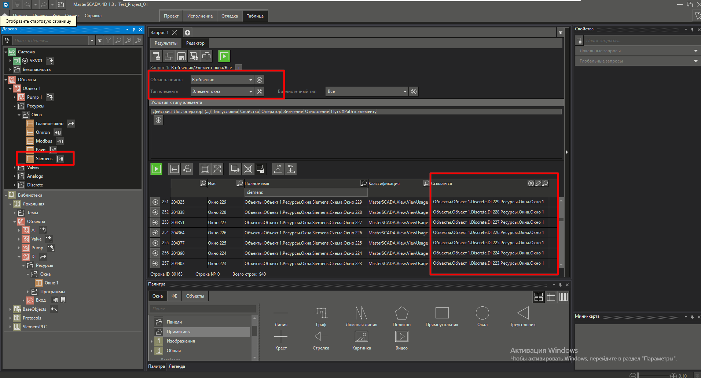
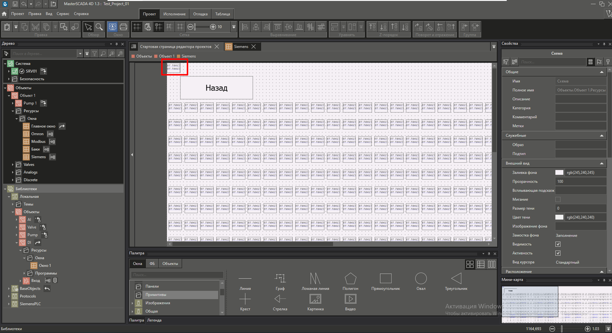
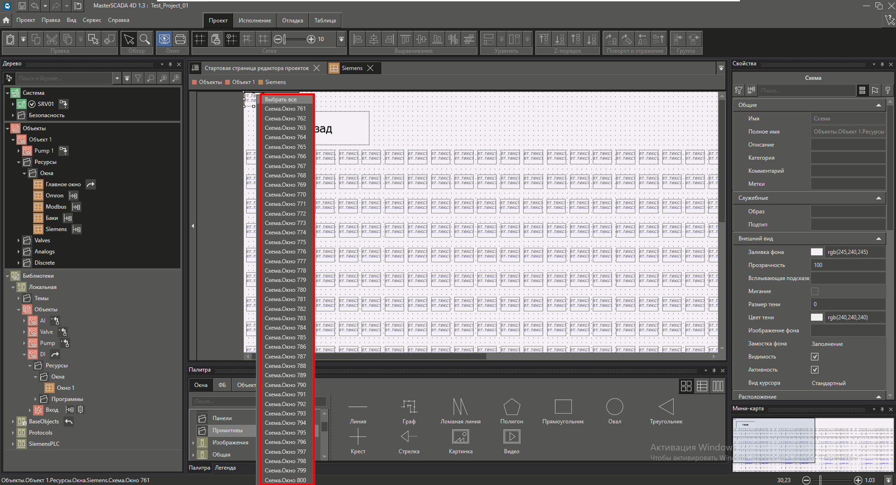

# Импорт объектов в окно (на мнемосхему)

- [Настройки табличной обработки](#%D0%9D%D0%B0%D1%81%D1%82%D1%80%D0%BE%D0%B9%D0%BA%D0%B8-%D1%82%D0%B0%D0%B1%D0%BB%D0%B8%D1%87%D0%BD%D0%BE%D0%B9-%D0%BE%D0%B1%D1%80%D0%B0%D0%B1%D0%BE%D1%82%D0%BA%D0%B8)
- [Пример файла для импорта](#%D0%9F%D1%80%D0%B8%D0%BC%D0%B5%D1%80-%D1%84%D0%B0%D0%B9%D0%BB%D0%B0-%D0%B4%D0%BB%D1%8F-%D0%B8%D0%BC%D0%BF%D0%BE%D1%80%D1%82%D0%B0)
- [Источник](#%D0%98%D1%81%D1%82%D0%BE%D1%87%D0%BD%D0%B8%D0%BA)

## Настройки табличной обработки

С помощью табличной обработки возможно импортировать окна объектов в общее окно (на мнемосхему).

Импортированные окна (объекты) будут расположены в левом верхнем углу.

Если на навести на импортированные окна, то отобразится список с перечнем окон.

## Пример файла для импорта

>[!info] Для **Порядок-Z** объекты из колонки **Link~Ссылается~Reference** рекомендуется располагать в обратном порядке.

## Источник

1. Ивко Роман
