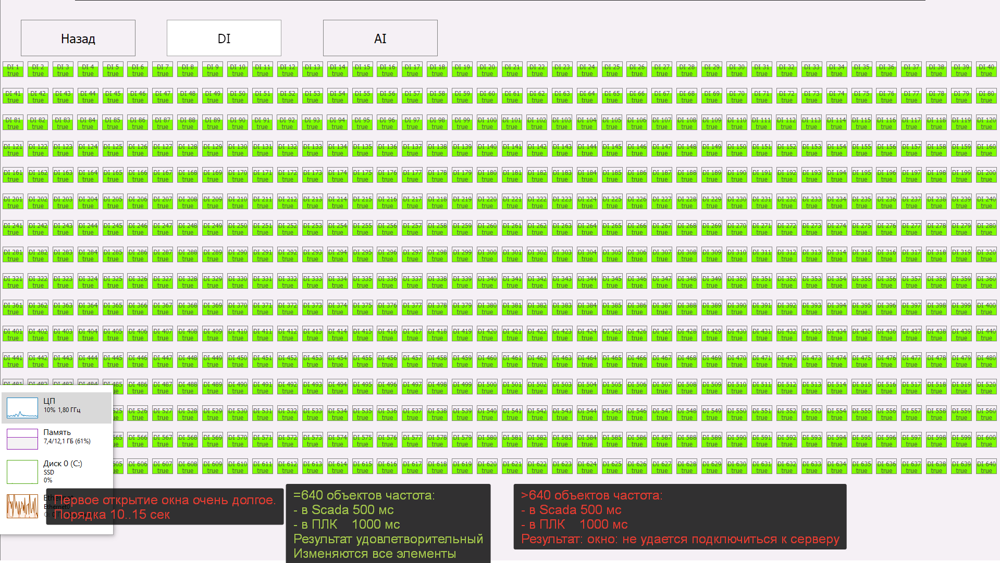
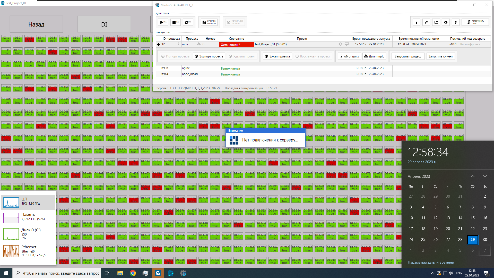
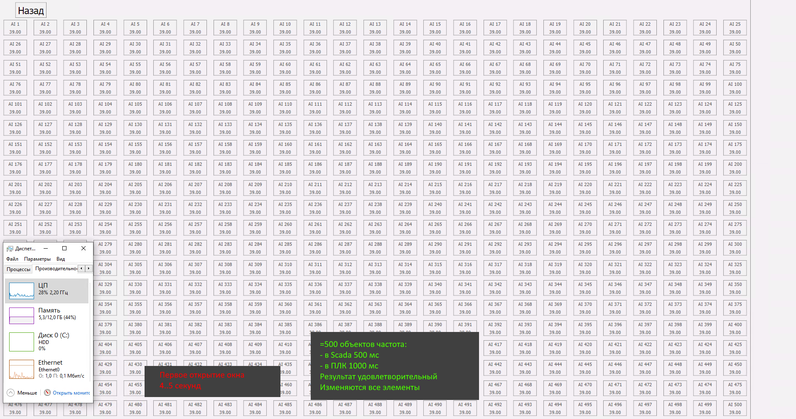

# Одновременное чтение сигналов

- [Одновременное отображение дискретных сигналов на мнемосхеме](#%D0%9E%D0%B4%D0%BD%D0%BE%D0%B2%D1%80%D0%B5%D0%BC%D0%B5%D0%BD%D0%BD%D0%BE%D0%B5-%D0%BE%D1%82%D0%BE%D0%B1%D1%80%D0%B0%D0%B6%D0%B5%D0%BD%D0%B8%D0%B5-%D0%B4%D0%B8%D1%81%D0%BA%D1%80%D0%B5%D1%82%D0%BD%D1%8B%D1%85-%D1%81%D0%B8%D0%B3%D0%BD%D0%B0%D0%BB%D0%BE%D0%B2-%D0%BD%D0%B0-%D0%BC%D0%BD%D0%B5%D0%BC%D0%BE%D1%81%D1%85%D0%B5%D0%BC%D0%B5)
	- [Исходные данные](#%D0%98%D1%81%D1%85%D0%BE%D0%B4%D0%BD%D1%8B%D0%B5-%D0%B4%D0%B0%D0%BD%D0%BD%D1%8B%D0%B5)
	- [Цель](#%D0%A6%D0%B5%D0%BB%D1%8C)
	- [Результат](#%D0%A0%D0%B5%D0%B7%D1%83%D0%BB%D1%8C%D1%82%D0%B0%D1%82)
- [Одновременное отображение аналоговых сигналов на мнемосхеме](#%D0%9E%D0%B4%D0%BD%D0%BE%D0%B2%D1%80%D0%B5%D0%BC%D0%B5%D0%BD%D0%BD%D0%BE%D0%B5-%D0%BE%D1%82%D0%BE%D0%B1%D1%80%D0%B0%D0%B6%D0%B5%D0%BD%D0%B8%D0%B5-%D0%B0%D0%BD%D0%B0%D0%BB%D0%BE%D0%B3%D0%BE%D0%B2%D1%8B%D1%85-%D1%81%D0%B8%D0%B3%D0%BD%D0%B0%D0%BB%D0%BE%D0%B2-%D0%BD%D0%B0-%D0%BC%D0%BD%D0%B5%D0%BC%D0%BE%D1%81%D1%85%D0%B5%D0%BC%D0%B5)
	- [Исходные данные](#%D0%98%D1%81%D1%85%D0%BE%D0%B4%D0%BD%D1%8B%D0%B5-%D0%B4%D0%B0%D0%BD%D0%BD%D1%8B%D0%B5)
	- [Цель](#%D0%A6%D0%B5%D0%BB%D1%8C)
	- [Результат](#%D0%A0%D0%B5%D0%B7%D1%83%D0%BB%D1%8C%D1%82%D0%B0%D1%82)

## Одновременное отображение дискретных сигналов на мнемосхеме

### Исходные данные

Master Scada 4D v1.3.1.31382.

ПЛК - SIEMENS SIMATIC ET200 SP.

Инженерный АРМ: виртуальная машина CPU i7-12800H. RAM 8GB. Видеопамять (вирт.) 8GB.

Инженерный АРМ: виртуальная машина CPU i7-12800H. RAM 8GB. Видеопамять (вирт.) 8GB.

### Цель

В ПЛК с частотой 1000мс инвертируются 1000 булевых переменных. Все переменные расположены в одной DB.

Определить максимальное количество одновременно отображаемых дискретных сигналов на мнемосхеме.

### Результат

По истечению 30 сек появилась сообщение **Нет подключения к серверу** и проект остановился. Частота опроса: раз в 5 сек и не все обновлялось.

## Одновременное отображение аналоговых сигналов на мнемосхеме

### Исходные данные

Master Scada 4D v1.3.1.31932.

ПЛК - SIEMENS SIMATIC ET200 SP.

Инженерный АРМ: виртуальная машина CPU Intel(R) Xeon(R) Silver 4114 CPU. RAM 12.0 ГБ. Видеопамять (вирт.) 8GB.

### Цель

В ПЛК с частотой 1000мс изменяются нарастающим счётчиком (шагом 0,10 от 0 до 100) 1000 переменных типа REAL. Все переменные расположены в одной DB.

Определить максимальное количество одновременно отображаемых аналоговых сигналов на мнемосхеме.

### Результат

