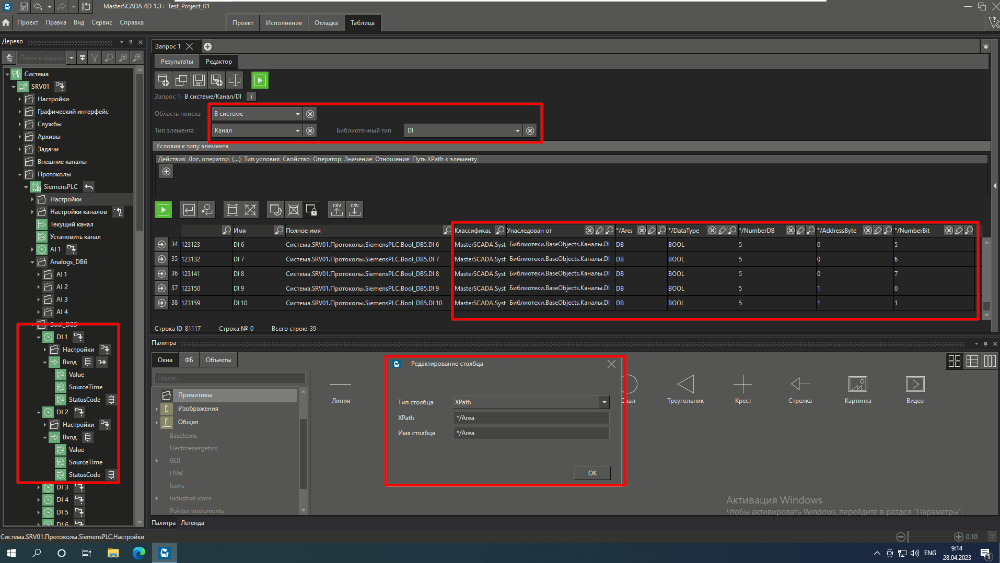

# Импорт тегов ПЛК SIEMENS с помощью табличной обработки

## Настройки

Основные колонки для импорта тегов ПЛК SIEMENS с помощью табличной обработки.

|**Колонка / XPath**|**Тип столбца**|**Примечание**|
|---|---|---|
|**Унаследован от**||Тип канала|
|***/Area**|XPath|Область памяти|
|***/DataType**|XPath|Тип данных|
|***/NumberDB**|XPath|Номер DB блока|
|***/AddressByte**|XPath|Номер байта в DB блоке|
|***/NumberBit**|XPath|Номер бита в байте (для bool переменных)|

>[!warning] Обязательно заполните колонку **Унаследован от**. В противном случае теги будут импортированы без системного типа данных **SYSTEM_xxx_PARAM**.

Колонку **PropertyId** можно оставить пустой. Значения будут присвоены автоматически.

## Источник

- Ивко Роман.