# Введение в работу с сообщениями

- [Типы стандартных сообщений](#%D0%A2%D0%B8%D0%BF%D1%8B-%D1%81%D1%82%D0%B0%D0%BD%D0%B4%D0%B0%D1%80%D1%82%D0%BD%D1%8B%D1%85-%D1%81%D0%BE%D0%BE%D0%B1%D1%89%D0%B5%D0%BD%D0%B8%D0%B9)
	- [Тревога](#%D0%A2%D1%80%D0%B5%D0%B2%D0%BE%D0%B3%D0%B0)
	- [Контроль границ](#%D0%9A%D0%BE%D0%BD%D1%82%D1%80%D0%BE%D0%BB%D1%8C-%D0%B3%D1%80%D0%B0%D0%BD%D0%B8%D1%86)
	- [Контроль скорости изменения](#%D0%9A%D0%BE%D0%BD%D1%82%D1%80%D0%BE%D0%BB%D1%8C-%D1%81%D0%BA%D0%BE%D1%80%D0%BE%D1%81%D1%82%D0%B8-%D0%B8%D0%B7%D0%BC%D0%B5%D0%BD%D0%B5%D0%BD%D0%B8%D1%8F)
	- [Базовое сообщение](#%D0%91%D0%B0%D0%B7%D0%BE%D0%B2%D0%BE%D0%B5-%D1%81%D0%BE%D0%BE%D0%B1%D1%89%D0%B5%D0%BD%D0%B8%D0%B5)
	- [Действия пользователей](#%D0%94%D0%B5%D0%B9%D1%81%D1%82%D0%B2%D0%B8%D1%8F-%D0%BF%D0%BE%D0%BB%D1%8C%D0%B7%D0%BE%D0%B2%D0%B0%D1%82%D0%B5%D0%BB%D0%B5%D0%B9)
	- [Системное сообщение](#%D0%A1%D0%B8%D1%81%D1%82%D0%B5%D0%BC%D0%BD%D0%BE%D0%B5-%D1%81%D0%BE%D0%BE%D0%B1%D1%89%D0%B5%D0%BD%D0%B8%D0%B5)
	- [Сообщения ИБ](#%D0%A1%D0%BE%D0%BE%D0%B1%D1%89%D0%B5%D0%BD%D0%B8%D1%8F-%D0%98%D0%91)
	- [Новый тип тревоги](#%D0%9D%D0%BE%D0%B2%D1%8B%D0%B9-%D1%82%D0%B8%D0%BF-%D1%82%D1%80%D0%B5%D0%B2%D0%BE%D0%B3%D0%B8)
- [Источники сообщений](#%D0%98%D1%81%D1%82%D0%BE%D1%87%D0%BD%D0%B8%D0%BA%D0%B8-%D1%81%D0%BE%D0%BE%D0%B1%D1%89%D0%B5%D0%BD%D0%B8%D0%B9)
	- [Шкала DI](#%D0%A8%D0%BA%D0%B0%D0%BB%D0%B0-di)
	- [Шкала AI](#%D0%A8%D0%BA%D0%B0%D0%BB%D0%B0-ai)
- [Приоритет](#%D0%9F%D1%80%D0%B8%D0%BE%D1%80%D0%B8%D1%82%D0%B5%D1%82)
- [Архивирование сообщений](#%D0%90%D1%80%D1%85%D0%B8%D0%B2%D0%B8%D1%80%D0%BE%D0%B2%D0%B0%D0%BD%D0%B8%D0%B5-%D1%81%D0%BE%D0%BE%D0%B1%D1%89%D0%B5%D0%BD%D0%B8%D0%B9)
	- [Архив сообщений по умолчанию](#%D0%90%D1%80%D1%85%D0%B8%D0%B2-%D1%81%D0%BE%D0%BE%D0%B1%D1%89%D0%B5%D0%BD%D0%B8%D0%B9-%D0%BF%D0%BE-%D1%83%D0%BC%D0%BE%D0%BB%D1%87%D0%B0%D0%BD%D0%B8%D1%8E)
	- [Работа с активными сообщениями](#%D0%A0%D0%B0%D0%B1%D0%BE%D1%82%D0%B0-%D1%81-%D0%B0%D0%BA%D1%82%D0%B8%D0%B2%D0%BD%D1%8B%D0%BC%D0%B8-%D1%81%D0%BE%D0%BE%D0%B1%D1%89%D0%B5%D0%BD%D0%B8%D1%8F%D0%BC%D0%B8)
	- [Работа с архивными сообщениями](#%D0%A0%D0%B0%D0%B1%D0%BE%D1%82%D0%B0-%D1%81-%D0%B0%D1%80%D1%85%D0%B8%D0%B2%D0%BD%D1%8B%D0%BC%D0%B8-%D1%81%D0%BE%D0%BE%D0%B1%D1%89%D0%B5%D0%BD%D0%B8%D1%8F%D0%BC%D0%B8)
- [Список программных имен параметров тревог](#%D0%A1%D0%BF%D0%B8%D1%81%D0%BE%D0%BA-%D0%BF%D1%80%D0%BE%D0%B3%D1%80%D0%B0%D0%BC%D0%BC%D0%BD%D1%8B%D1%85-%D0%B8%D0%BC%D0%B5%D0%BD-%D0%BF%D0%B0%D1%80%D0%B0%D0%BC%D0%B5%D1%82%D1%80%D0%BE%D0%B2-%D1%82%D1%80%D0%B5%D0%B2%D0%BE%D0%B3)
- [Сообщения для дискретных шкал OPC UA](#%D0%A1%D0%BE%D0%BE%D0%B1%D1%89%D0%B5%D0%BD%D0%B8%D1%8F-%D0%B4%D0%BB%D1%8F-%D0%B4%D0%B8%D1%81%D0%BA%D1%80%D0%B5%D1%82%D0%BD%D1%8B%D1%85-%D1%88%D0%BA%D0%B0%D0%BB-opc-ua)
- [Источник](#%D0%98%D1%81%D1%82%D0%BE%D1%87%D0%BD%D0%B8%D0%BA)

Сообщения предназначены для регистрации событий, возникающих при работе АСУ ТП, систем диспетчеризации и др.

Сообщение является **активным**, если зарегистрированное событие еще происходит в данный момент времени.

Сообщение становится **неактивным**, если событие, приведшее к его появлению, закончилось.

По каждому источнику может быть только одно активное сообщение – то, которое появилось последним. Например, произошло событие – появилось **активное сообщение**, затем **выключили среду исполнения** (факт окончания события не был зафиксирован). Когда **среду исполнения перезапустили**, событие повторилось заново. Несмотря на то, что перед этим окончание предыдущего события не было зафиксировано, сообщение о нем не будет считаться активным. Активным будет считаться только последнее сообщение, у которого нет окончания.

Все сообщения, которые появляются во время работы исполнительной системы, сначала попадают в оперативную память устройства, а затем постепенно копируются из нее в базу данных.

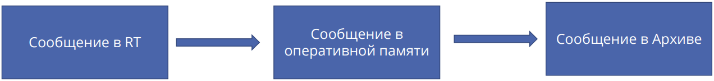

Если связь с базой данных установить не удается, то сообщения будут сохраняться в оперативной памяти до тех пор пока связь с БД не будет восстановлена.

По каждому источнику копия **последнего сообщения** остается в оперативной памяти - такие сообщения называют **актуальными**, т.е. последнее неактивное сообщение по какому-либо источнику также остается в оперативной памяти до тех пор, пока не появится новое сообщение.

При старте исполнительной системы или ее перезагрузки из базы данных считываются **последние сообщения** для всех источников узла.

Если до перезагрузки сообщение было активным, то перед загрузкой в оперативную память параметр сообщения **Active**, установится из **FALSE** в **TRUE**. Таким образом в штатном режиме по каждому источнику/типу сообщения в оперативной памяти будет хранится не более одного сообщения. Это необходимо для того, чтобы быстрее получать доступ к актуальным сообщениям в журнале и для работы специализированных функциональных блоков, например, **EventsCounter**.

**Журнал** – это элемент окна, который служит для работы с сообщениями в **клиенте**.

Сообщения можно разделить на **условные** и **безусловные**:

- **Условное сообщение** – это сообщение, регистрирующее событие, у которого есть начало и есть конец. Например, если от модуля ввода-вывода пришел дискретный сигнал, обозначающий аварию частотного преобразователя, то до тех пор пока значение сигнала не изменится, сообщение будет считаться активным. В MasterSCADA 4D для работы с такими сообщениями предусмотрен тип сообщения **Тревога**. Тревога предназначена для работы с произвольными условными сообщениями. В случае если при использовании шкал у параметров заданы аварийные и предупредительные границы, то при нарушении границ автоматически будут выдаваться сообщения о **нарушении границ (НАУ (LL), НПУ (L), ВПУ (H), ВАУ (HH))** и **превышении скорости изменения (RoC - Rate of Change)**.
    
- **Безусловное сообщение** – это сообщение, которое регистрирует событие, имеющее начало, но не имеющее конца. Например, сообщение о смене режима работы насосов: тот, что работал резервным стал основным, а тот, что был основным, переключился в резерв. Для работы с произвольными безусловными сообщениями в MasterSCADA 4D используется элемент **Базовое Сообщение**. К **безусловным сообщениям** можно отнести сообщения, фиксирующие действия операторов. Эти сообщения, в зависимости от настроек прав доступа, формируются автоматически.
    

В MasterSCADA 4D система сообщений поддерживает механизм квитирования. **Квитирование** – это операция, производимая, как правило, оператором (реже автоматически) для подтверждения факта приема сообщения. Сообщение может быть квитировано оператором в журнале при помощи специальных механизмов, а также программно.

Если сообщение не требует квитирования, то исходно у него свойство **Квитированность** (**acked**) имеет значение **TRUE**.

Сообщения могут создаваться в **узлах**, **объектах**, **тегах** и **каналах** при помощи контекстного меню либо **контекстной панели:**

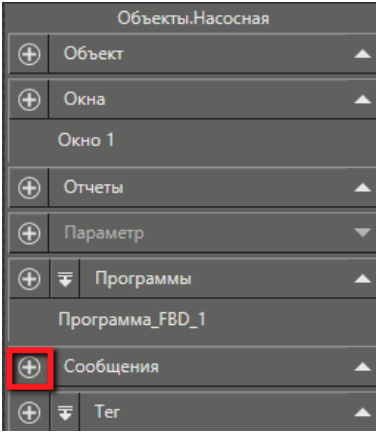

## Типы стандартных сообщений

В MasterSCADA 4D по умолчанию предусмотрены следующие типы сообщений:

- **Тревога**;
- **Контроль границ**;
- **Контроль скорости изменения**;
- **Базовое сообщение**.

### Тревога

Тип сообщения **Тревога** служит для формирования **условных сообщений**. Тревоги могут создаваться в **узлах**, **объектах**, **тегах** и **каналах** при помощи контекстного меню либо **контекстной панели**:

Созданное сообщение появится в группе **Сообщения**. В Дереве **Тревога** имеет следующий вид:

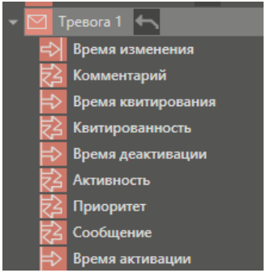

Параметры, представленные в **дереве**, отображаются также и в **панели свойств** элемента, в группах **Параметры** и **Состояние**:

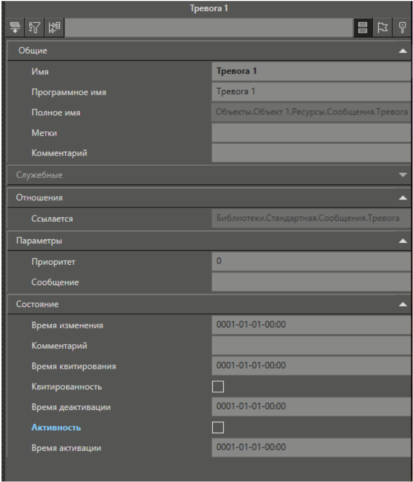

Если разработчик работает с **тревогами** в **программе**, то необходимо использовать **программные имена** полей тревог.

Описание свойств (параметров) Тревоги:

|   |   |   |
|---|---|---|
|**Название** (**Програм. имя**)|**Тип**|**Назначение**|
|Приоритет (Severity)|DINT|Служит для присвоения сообщениям уровня важности. Каждый разработчик проекта может ввести свою систему приоритетов, например, 1 – авария, самый высокий, а 5 - информация, самый низкий. Назначение сообщениям разной приоритетности можно использовать в дальнейшем для настройки фильтров журнала, например, выводить в журнал только сообщения с приоритетом равным единице. В приведенном примере это будет обозначать показ только аварийных сообщений.|
|Сообщения (Message)|STRING|Задается текст сообщения. Как правило, значение задается в виде константы. В базах данных возможно хранение сообщений больше 255 символов. При необходимости можно установить связь параметра со строковой переменной (например, выходом программы), в которой будет формироваться разный текст сообщения. Можно в текст тревоги включать значения различных параметров тревоги на тот момент времени, когда тревога стала активной, для этого нужно создать **шаблон тревоги**. Возможные варианты создания **шаблона тревоги**: - <Текст>{Программное_имя_1}{Программное_имя_2} <Текст><Программное_имя_3>;      - <Текст>{/пробел[ы]/Программное_имя_1/пробел[ы]/}{/пробел[ы]/Программное_имя_2} <Текст><Программное_имя_3/пробел[ы]/>.      Шаблоны не могут содержать пустые скобки ( {} ), скобки с пробелом(-ми) внутри ( { } ), повторения открывающихся или закрывающихся скобок ( {{, }} ), не открытые и не закрытые скобки ( }, { ). Строка внутри скобок должна полностью соответствовать **программному имени** параметра тревоги. В случае несоответствия сообщения шаблону, программа выведет исходное сообщение. Если сообщение соответствует шаблону, то вместо программного имени в скобках будет выведено текущее значение искомого параметра. Например, рассмотрим использование значения параметра тревоги **Активность** (**Active**) в сообщении. Текст параметра тревоги **Сообщение** будет иметь вид: - Сработала охрана. Значение параметра Активность = {Active}      Тогда в режиме исполнения в журнале мы получим: - Сработала охрана. Значение параметра Активность = true.      Ели необходимо в текст сообщения тревоги добавить значение произвольного параметра, то нужно создать новый тип тревоги, в который добавить нужные параметры и при создании шаблона тревоги использовать его программное имя. В базах данных **MS SQL** и **Postgre** возможно хранение сообщений **больше 255** **символов**. В **других БД** поддерживается хранения сообщений **до 255 символов**.|
|Время изменения (ChangeTi me)|DT|Показывается время последнего изменения **Тревоги**. Совпадает с одним из трех параметров: временем активации, временем квитирования, временем деактивации.|
|Комментарий (Comment)|STRING|Может содержать произвольный текст. Как правило, заполняется оператором при квитировании сообщения.|
|Время квитирования (AckedTime)|DT|Выдается момент времени, в который оператор квитировал сообщение, т.е. когда свойство **Квитированность** изменилось с **False** на **TRUE**.|
|Квитированность (Acked)|BOOL|Отображается состояние квитирования сообщения, т.е. показывается, зафиксировал ли его оператор или нет. Если **Квитированность** =**TRUE**, то сообщение помечено как **квитированное**. Если **Квитированность** = **False**, то сообщение считается **неквитированным**. В зависимости от этого параметра можно задать фильтры журнала сообщений, например, для отображения только неквитированных сообщений или неквитированных и активных. Значение данного параметра может быть изменено при помощи специальных инструментов журнала сообщений. При старте исполнительной системы для всех тревог, которые не срабатывали устанавливается значение **TRUE** для параметра тревоги **Квитированность**. После того как тревога сработает - параметр **Активность** изменит значение с **False** на **TRUE.** Квитированность примет значение **False** до того момента, пока сообщение не будет квитировано пользователем или программно.|
|Время деактивации (InactiveTime)|DT|Отображается момент времени, в который сообщение перестало быть актуальным (активным), т.е. когда свойство **Активность** изменилось с **TRUE** на **False**. При этом сообщение становится архивным.|
|Активность (Active)|BOOL|Если значение этого свойства становится равным **TRUE**, то сообщение считается актуальным (**активным**). Изменение значения свойства с **TRUE** на **False**, означает, что сообщение перестает быть актуальным. Это свойство необходимо связать с каким-либо параметром (например, выходом программы).|
|Время активации (ActiveTime)|BOOL|Отображается время, когда **Активность** изменила состояние с **False** на **TRUE**.|

Тип сообщения **Тревога** хранится в библиотеке **Стандартная**, в группе **Сообщения**. Разработчик проекта на основе данного типа может создать свои типы **тревог**, например, добавив свои собственные параметры, которые будут архивироваться и выводиться в журнал.

### Контроль границ

**Сообщение о нарушении границ** – это **условное** сообщение, поступающее в случае, если значение параметра в режиме исполнения вышло за заданные пределы в назначенной шкале.

Этот тип сообщения находится в библиотеке **Стандартная**:

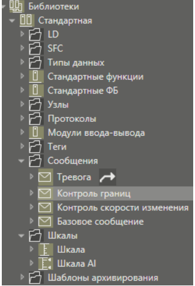

Настройка элемента не производится.

Сообщения будут автоматически попадать в **журнал сообщений** в соответствии с настройками журнала.

**Время активации**, **время деактивации** и другие параметры состояния будут зависеть от настроек **шкалы** параметра и его значения в тот или иной момент времени.

В зависимости от того, какую границу нарушит параметр, для которого назначена шкала, текст сообщения будет разным:

- Верхнее аварийное,
- Верхнее предупредительное,
- Нижнее предупредительное,
- Нижнее аварийное.

### Контроль скорости изменения

**Сообщение о превышении скорости изменения** – это **условное** сообщение, поступающее в случае, если в режиме исполнения значение параметра изменилось быстрее, чем задано в настройках назначенной шкалы.

Такой тип сообщения находится в библиотеке **Стандартная**:

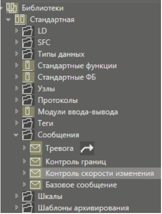

Настройка элемента не производится.

Сообщения будут автоматически попадать в журнал сообщений в соответствии с настройками журнала.

Текст сообщения будет:

- Максимальная скорость изменения.

**Время активации**, **время деактивации** и другие параметры состояния будут зависеть от настроек **шкалы** параметра и его значения в тот или иной момент времени.

### Базовое сообщение

**Базовое сообщение** используется для формирования **безусловных** сообщений. **Безусловное сообщение** создается в MasterSCADA 4D при помощи ФБ **FireBaseEvent**.

Данный тип сообщений находится в библиотеке **Стандартная**:

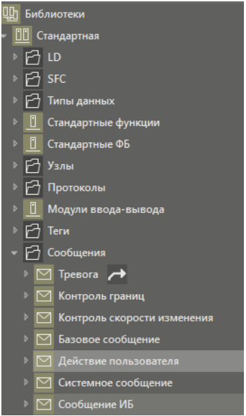

### Действия пользователей

Этот тип сообщений используется для формирования сообщений **по действиям пользователей**.

Если в настройках прав доступа для конкретного действия установлен флаг **Журнал**, то когда пользователь произведет данное действие, сообщение о нем появится в системе автоматически:

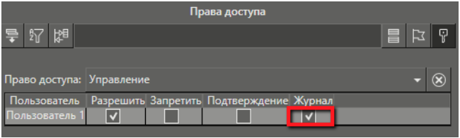

Сообщения, сигнализирующие о начале и окончании сессии пользователей формируются автоматически.

Данный тип сообщений находится в библиотеке **Стандартная**.

Дополнительных настроек не требуется.

Сообщения будут автоматически попадать в журнал сообщений, в соответствии с  
настройками журнала.

Если в группу **Безопасность** добавлен **Архив сообщений ИБ**, то сообщения данного типа  
автоматически будут попадать в этот архив.

### Системное сообщение

Этот тип сообщений используется для формирования **безусловных** сообщений следующих видов:

- Сообщения об ошибках ключа защиты.
- Сообщения об ошибках, возникших во время проверки целостности системного и прикладного ПО.

Данный тип сообщений находится в библиотеке **Стандартная**.

Сообщения данного типа формируются автоматически.

Просмотреть сообщения можно используя журнал сообщений, в соответствии с настройками журнала.

### Сообщения ИБ

Этот тип сообщений используется для формирования **безусловных** сообщений следующих видов:

- Сообщение об ошибке ключа защиты:
    - "Ключ не найден. Проект остановлен."
    - "Ключ не найден. Проект будет остановлен через %d минут."
- Сообщения контроля целостности:
    - "Ошибка при проверке целостности проекта:"
    - "Ошибка при проверке целостности ПО:"
- Сообщения об операциях над **пользователями в режиме исполнения** Сообщения данного типа состоят из постоянной части "**Неуспешная попытка входа**" к которой добавляется причина возникновения сообщения:
    - "Неудачная смена пароля"
    - "Необходимо сменить пароль"
    - "Пользователь заблокирован"
    - "Срок действия пароля истёк"
    - "Недопустимое время логина"
    - "Недопустимый адрес логина"
- Сообщение о блокировке пользователя, которая была вызвана настройкой **Количество последовательных неуспешных попыток входа**:
    - "Пользователь " + login + " заблокирован по превышению попыток логина"
- Сообщения об авторизации пользователя:
    - "Вход в систему"

Данный тип сообщений находится в библиотеке **Стандартная**.

Дополнительных настроек не требуется.

Сообщения будут автоматически попадать в журнал сообщений, в соответствии с настройками журнала.

Если в группу **Безопасность** добавлен **Архив сообщений ИБ**, то сообщения данного типа автоматически будут попадать в этот архив.

### Новый тип тревоги

Разработчик проекта может создать свой **Тип тревоги** в **пользовательской библиотеке**. Это целесообразно делать в случае когда необходимо кроме стандартных параметров тревоги сохранять в базе данных и выводить в журнале дополнительную информацию, либо в том случае, если набор параметров соотвествует требованиям, но необходимо задать предопределенные значения свойств (параметров).

Если также необходимо, чтобы разные типы тревог имели разные обозначения в столбце журнала в поле **Иконка**, то следует в библиотеке при помощи контекстного меню **Тревоги** выбрать пункт **Дерево - Установить иконку**.

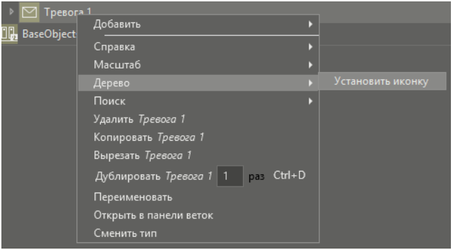

## Источники сообщений

>[!info] По умолчанию все сообщения архивируются.

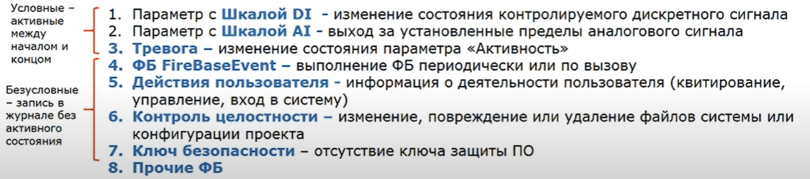

### Шкала DI

**Шкала DI** устанавливается у дискретного параметра.

Задается **Сообщение при включении** и **Сообщение при отключении**.

### Шкала AI

**Шкала AI** устанавливается у численного параметра.

Должны быть включены **НАУ (LoLo)**, **НПУ (Lo)**, **ВПУ (Hi)**, **ВАУ (HiHi)**.

Свойства шкал **динамизируются**.

В **журнал** полезно добавлять столбец **Значение**.

## Приоритет

**Приоритет** применяется для фильтрации сообщений. Чем выше приоритет, тем более критичное сообщение.

>[!info]- Рекомендую использовать диапазоны от **0** до **999**. См. таблицу ниже.
>
>|**Приоритет**|**Тип сообщения**|**Примечание**|
>|---|---|---|
>| 000 - 249 | Информационное | |
>| 250 - 499 | | |
>| 500 - 749 | Предупреждение | |
>| 750 - 999 | Критическое | |

|**Приоритет**|**Тип сообщения**|**Примечание**|
|---|---|---|
|000 - 249|Информационное||
|250 - 499|||
|500 - 749|Предупреждение||
|750 - 999|Критическое||

## Архивирование сообщений

Все сообщения, возникающие в среде исполнения, автоматически попадают в архив. Архивирование сообщений поддерживается на всех ОС.

Для хранения архивов могут быть использованы следующие базы данных:

- SQLITE;
- POSTGRESQL;
- MS SQL.

Настройки архивирования сообщений задаются в панели свойств элемента **Основной архив сообщений**.

При архивировании сообщений в архив записывается новая строка при каждом изменении состояния сообщения:

- Появление;
- Квитирование;
- Исчезновение.

Пример базы данных сообщений:

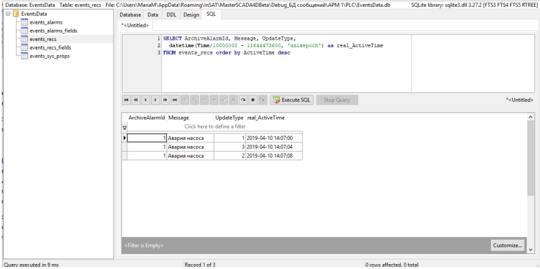

### Архив сообщений по умолчанию

По умолчанию архив сообщений хранится в базе данных SQLite.

Файл базы данных носит название **EventsData.db**.

Если проект запускается в среде исполнения, входящей в состав среды разработки, то архив будет хранится в папке:

- _<профиль пользователя>\AppData\Roaming\MPSSot\<продукт>\Debug_<имя проекта>\<имя узла>\PLC\EventsData.db._

В среде исполнения, установленной независимо от среды разработки, файл архива будет храниться в папке:

- _c:\Users\[имя пользователя]\AppData\Roaming\MPSSot\MasterSCADA4DRT1.2\Server\EventsData.db_

Архив сообщений на других ОС хранится внутри папки mplc.

### Работа с активными сообщениями

Для просмотра активных сообщений используется элемент **Журнал**.

В базе сообщений в таблице **events_alarms** есть столбцы **EventType** и **LastRecId**. **LastRecId** указывает на последнюю запись сообщения активации в таблицу **events_recs**.

При загрузке исполнительной системы в журнал будут загружены из базы данных активные сообщения.

### Работа с архивными сообщениями

Для просмотра архивов сообщений в MasterSCADA 4D предусмотрен графический элемент – **Архивный журнал**.

## Список программных имен параметров тревог

В программах, на входах функциональных блоках, предназначенных для работы с сообщениями нужно использовать программные имена, а не те которые отображаются в дереве.

Таблица соответствия между названием параметра тревоги и его программным именем:

|**Название/Описание**|**Тип**|**Программное имя**|
|---|---|---|
|**Основные** - параметры, которые отображаются в дереве проекта|   |   |
|Время активации|DATE_AN D_TIME|ActiveTime|
|Время деактивации|DATE_AN D_TIME|InactiveTime|
|Время квитирования|DATE_AN D_TIME|AckedTime|
|Активность|BOOL|Active|
|Квитированность|BOOL|Acked|
|Приоритет|DINT|Severity|
|Сообщение|STRING|Message|
|Комментарий, выставляемый при квитировании|STRING|Comment|
|Время изменения|DATE_AN D_TIME|Time|
|**Вспомогательные** - параметры, которые не отображаются, но которые можно использовать при работе с сообщениями в журнале или в функциональных блоках, программах|   |   |
|Идентификатор записи сообщения в архиве|DINT|RecId|
|Id источника сообщения (если источник внутри экземпляра объекта, то в ItemId передается Id экземпляра объекта)|LINT|ItemId|
|Идентификатор сообщения|STRING|EventId|
|IP - адрес клиента, с которого выполнено квитирование|STRING|ClientAddress|
|Имя пользователя, который выполнил квитирование|STRING|ClientUserId|
|Путь внутри экземпляра с Id, указанным в параметре ItemId|STRING|Path|
|Тип сообщения|STRING|EventType|
|Битовая маска состояния: **0** - не активно, не квитировано; **1** - не активно, квитировано; **2** - активно, не квитировано; **3** - активно, квитировано.|UINT|EventState|
|Имя объекта, включающее полный путь в дереве объектов|STRING|EventFullObjectName|
|Имя объекта|STRING|EventObjectName|
|Источник сообщений|STRING|EventSourceName|

## Сообщения для дискретных шкал OPC UA

В MasterSCADA 4D можно организовать формирование сообщений на основе **архивных данных**, поступивших по протоколу **OPC UA**,с использованием дискретной **шкалы DI**.

Для этого необходимо, чтобы дискретный параметр узла-сервера архивировался. Также в **параметр** должна быть добавлена **шкала DI** с требуемыми настройками сообщений при включении/выключении и значениями приоритета сообщений.

У **узла**, который будет получать значения от сервера, должен быть **добавлен** протокол **OPC UA** со следующими настройками:

- выставить нужный период получения архивных данных;
- выбрать режим чтение для архивов;
- включить галочку чтение архивов.

Настройка протокола в панели свойств:

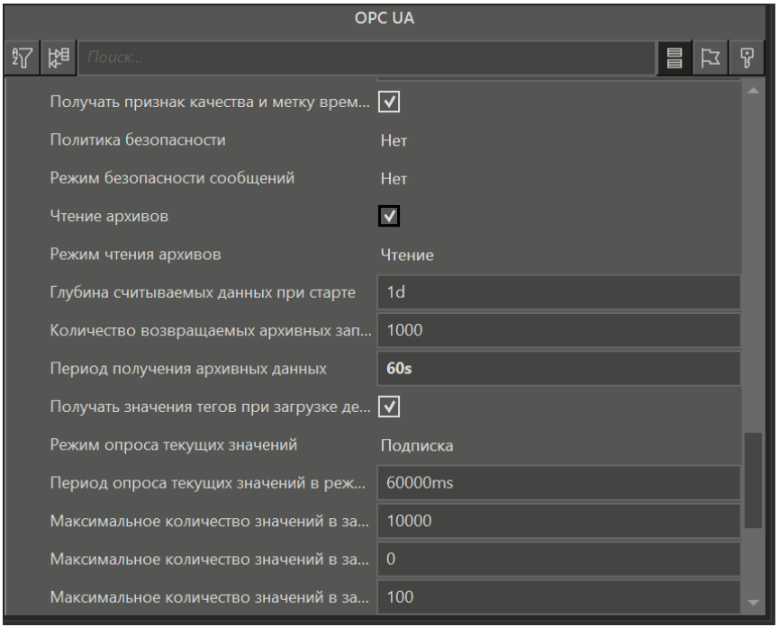

Если на дискретный архивируемый канал назначена шкала и включено чтение архивов, то выдача сообщений шкалы будет не по текущим данным, а по архивным.

Также должен быть добавлен параметр того же типа данных для связи с первым узлом.

Для вывода данных в окне можно использовать **Журнал** и **Архивный журнал**. В обоих случаях в панели свойств элементов нужно выставить настройку **Глобальный**:

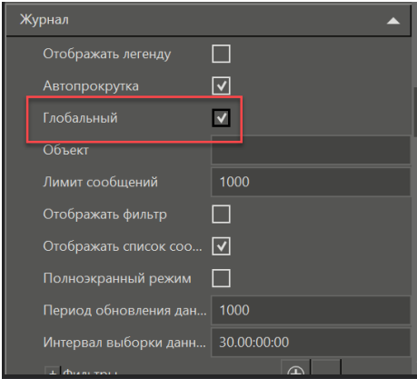

При работе с **Журналом** сообщения будут постоянно обновляться, так как их получение происходит по подписке, а не в режиме чтения.

Вывод сообщений в **Журнал** на примере активации/деактивации сигнала (параметра связанного с выходом генератора сигнала):

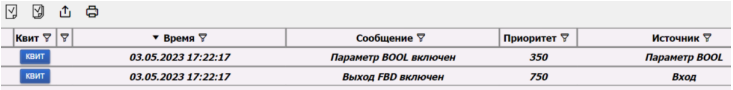

При выводе сообщений в **Архивный журнал**, используя пример выше, будут отображаться сообщения от обеих шкал - в канале протокола и в параметре:

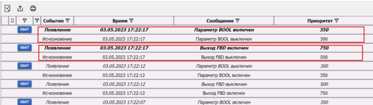

## Источник

1. [MasterSCADA 4D™. Руководство пользователя. Версия 1.3.X. 2023](https://support.mps-soft.ru/Site/MasterSCADA%204D/User%20Guide%20MasterSCADA%204D.pdf)
2. [https://www.youtube.com/watch?v=2Y2AqNCAB7I](https://www.youtube.com/watch?v=2Y2AqNCAB7I)
3. Базовый курс MasterSCADA 4D. Занятие_14 Система сообщений.pdf.
