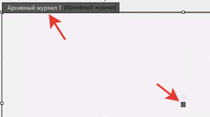
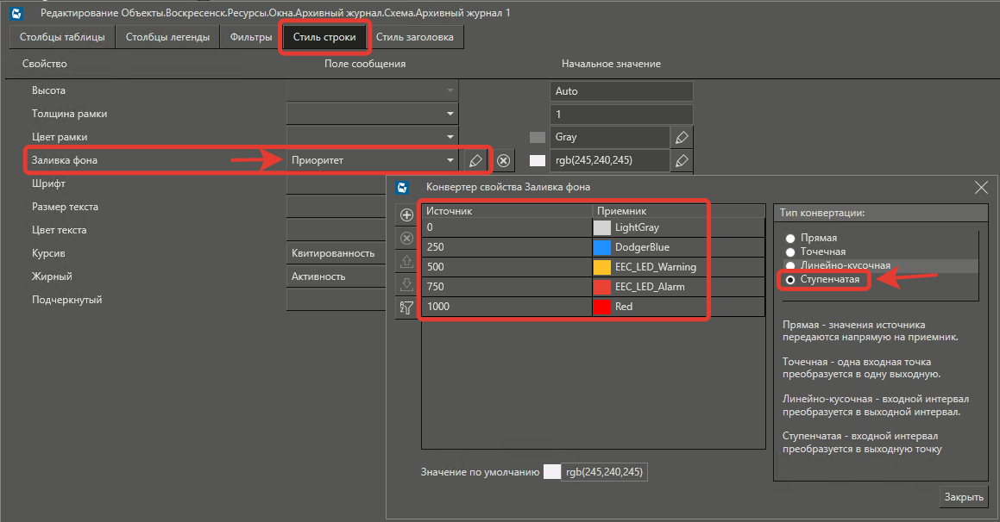
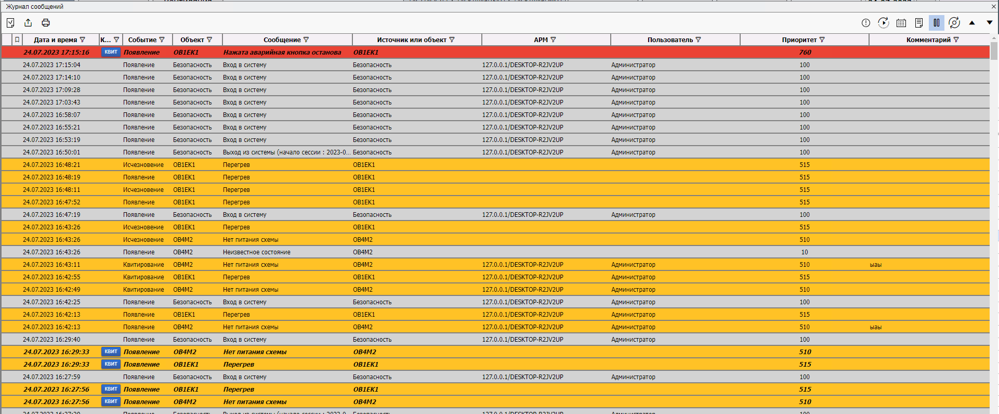

# Подсветка сообщений в журнале по приоритету

В редакторе в центре области журнала нажмите кнопку **Редактирование**.

Перейдите на вкладку **Стиль строки**. Для параметра **Заливка фона** выберите поле **Приоритет** и нажмите кнопку **Редактировать конвертацию**.

В окне **Конвертер свойства** выберите тип конвертации **Ступенчата**. Затем укажите диапазоны и названия цветов (или rgb кодов).

Запустив среду исполнения и открыв журнал мы увидим разный фон сообщений в зависимости от приоритета.

