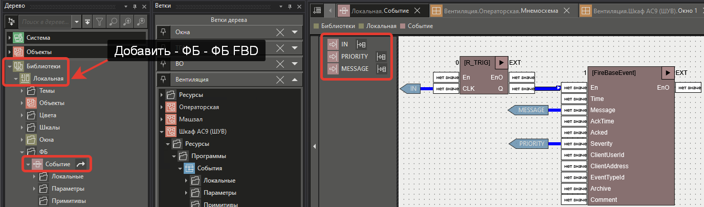
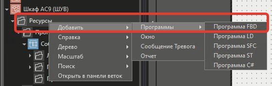
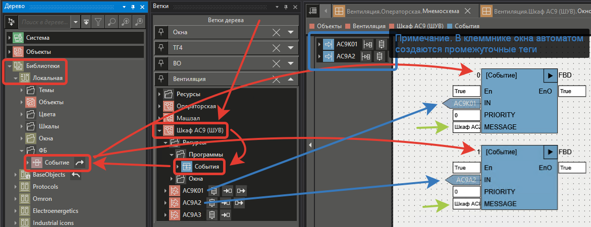
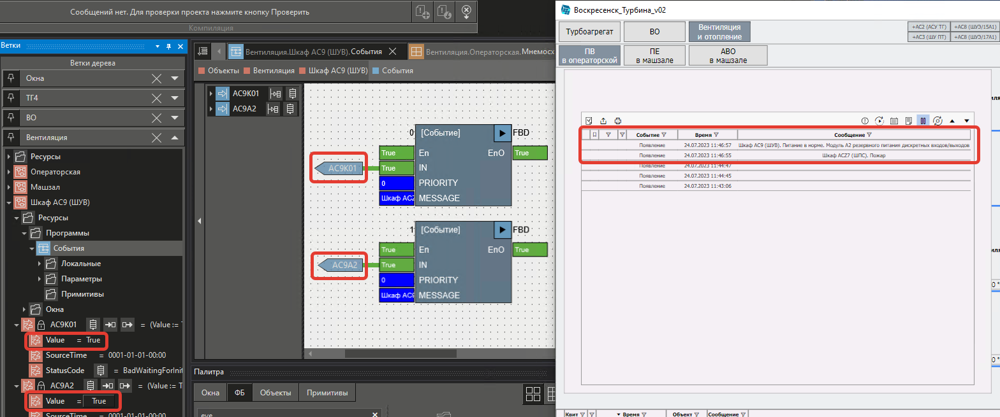

# Создание события (сообщения) по bool условию

- [Цель](#%D0%A6%D0%B5%D0%BB%D1%8C)
- [Решение](#%D0%A0%D0%B5%D1%88%D0%B5%D0%BD%D0%B8%D0%B5)
	- [Создание ФБ блока](#%D0%A1%D0%BE%D0%B7%D0%B4%D0%B0%D0%BD%D0%B8%D0%B5-%D0%A4%D0%91-%D0%B1%D0%BB%D0%BE%D0%BA%D0%B0)
	- [Использование ФБ блока](#%D0%98%D1%81%D0%BF%D0%BE%D0%BB%D1%8C%D0%B7%D0%BE%D0%B2%D0%B0%D0%BD%D0%B8%D0%B5-%D0%A4%D0%91-%D0%B1%D0%BB%D0%BE%D0%BA%D0%B0)
	- [Проверка работы](#%D0%9F%D1%80%D0%BE%D0%B2%D0%B5%D1%80%D0%BA%D0%B0-%D1%80%D0%B0%D0%B1%D0%BE%D1%82%D1%8B)

## Цель

Создать событие (сообщение).

## Решение

### Создание ФБ блока

Если в проекте сообщений будет много, то рекомендую создать **ФБ** блок и вынести наружу только основные настраиваемые параметры.

>[!info] Причину использования R_TRIG смотри в [При использовании FireBaseEvent многократно появляется одно и тоже сообщение](../Вопрос-Ответ/Вопросы%20про%20программирование/При%20использовании%20FireBaseEvent%20многократно%20появляется%20одно%20и%20тоже%20сообщение.md).

Настройки параметров ФБ блока.

|**Имя**|**Тип**|**Начальное значение**|**Примечание**|
|---|---|---|---|
|IN|BOOL|FALSE|Входное условие|
|PRIORITY|DINT|0|Приоритет сообщения|
|MESSAGE|STRING||Текст сообщения|

### Использование ФБ блока

### Проверка работы

