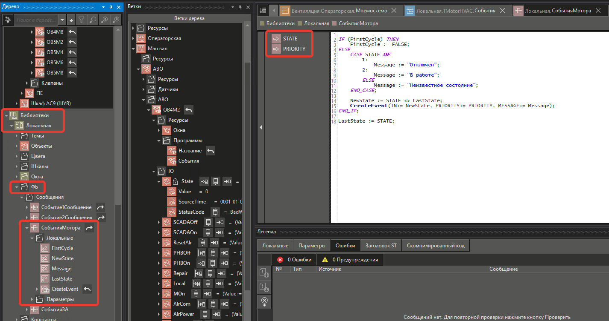
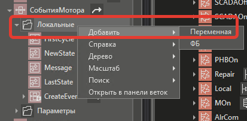
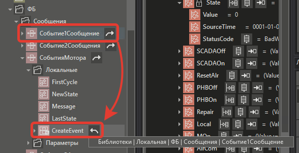
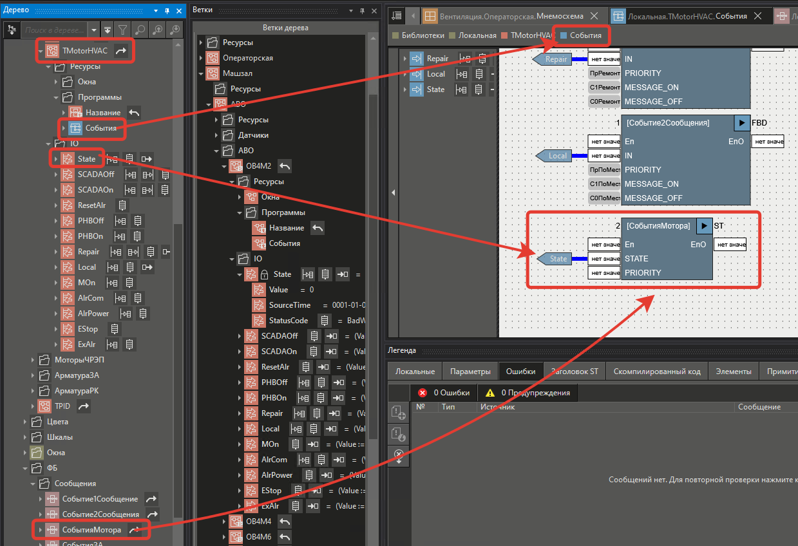
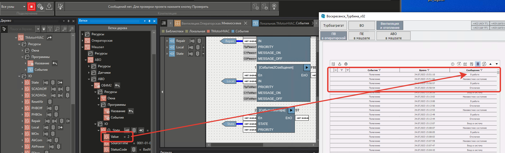

# Создание события (сообщения) по int условию

- [Цель](#%D0%A6%D0%B5%D0%BB%D1%8C)
- [Решение](#%D0%A0%D0%B5%D1%88%D0%B5%D0%BD%D0%B8%D0%B5)
	- [Создание ФБ блока](#%D0%A1%D0%BE%D0%B7%D0%B4%D0%B0%D0%BD%D0%B8%D0%B5-%D0%A4%D0%91-%D0%B1%D0%BB%D0%BE%D0%BA%D0%B0)
	- [Использование ФБ блока](#%D0%98%D1%81%D0%BF%D0%BE%D0%BB%D1%8C%D0%B7%D0%BE%D0%B2%D0%B0%D0%BD%D0%B8%D0%B5-%D0%A4%D0%91-%D0%B1%D0%BB%D0%BE%D0%BA%D0%B0)
	- [Проверка работы](#%D0%9F%D1%80%D0%BE%D0%B2%D0%B5%D1%80%D0%BA%D0%B0-%D1%80%D0%B0%D0%B1%D0%BE%D1%82%D1%8B)

## Цель

Создать события (сообщения) исходя из значения переменной типа INT.

## Решение

### Создание ФБ блока

В **локальной библиотеке** создайте **ФБ** блок на языке **ST**.



Настройки параметров ФБ блока, которые доступны снаружи.

|**Имя**|**Тип**|**Начальное значение**|**Примечание**|
|---|---|---|---|
|STATE|INT|0|Входное условие|
|PRIORITY|DINT|**10**|Приоритет сообщения|

**Локальная** переменная не доступна снаружи блока.

Чтобы создать локальные переменные в ФБ блоке нужно нажать **ПКМ** по папке **Локальные** и выбрать пункт **Добавить** - **Переменная**.



|**Имя**|**Тип**|**Начальное значение**|**Сохранять**|**Примечание**|
|---|---|---|---|---|
|FirstCycle|BOOL|**TRUE**|**Нет**|Флаг первого запуска блока|
|NewState|BOOL|FALSE|Наследуется|Флаг, что состояние изменилось|
|Message|STRING||Наследуется|Текст сообщения|
|LastState|INT|0|Наследуется|Предыдущее значение входного условия|
|CreateEvent|ФБ|-|-|Пользовательский функциональный блок. Его создание можно посмотреть по [ссылке](Создание%20события%20(сообщения)%20по%20bool%20условию.md).|

ФБ блок **CreateEvent** - это пользовательский функциональный блок. Его создание можно посмотреть в [Создание события (сообщения) по bool условию](Создание%20события%20(сообщения)%20по%20bool%20условию.md).



Текст скрипта представлен ниже.

Флаг `FirstCycle` необходим, чтобы при перезагрузке сервера MasterScada ложно не создавались сообщения.

```vb
IF (FirstCycle) THEN
    FirstCycle := FALSE;
ELSE 
    CASE STATE OF
        1: 
            Message := "Отключен";
        2: 
            Message := "В работе";
        ELSE 
            Message := "Неизвестное состояние";
    END_CASE;

    NewState := STATE <> LastState;
    CreateEvent(IN:= NewState, PRIORITY:= PRIORITY, MESSAGE:= Message);
END_IF;

LastState := STATE;

```

### Использование ФБ блока



### Проверка работы


