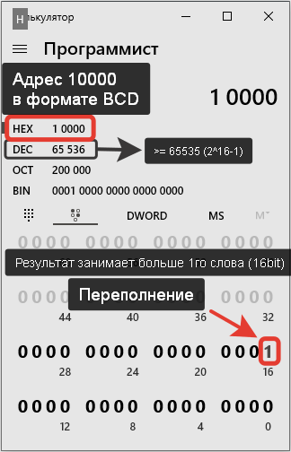
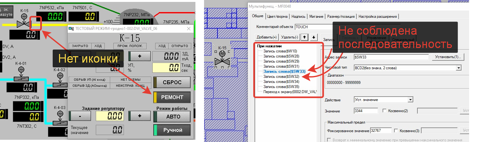
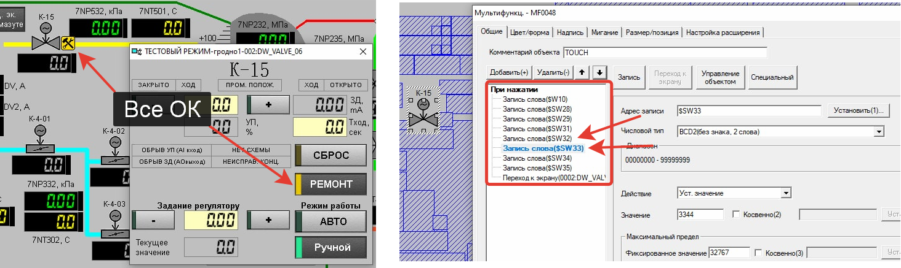
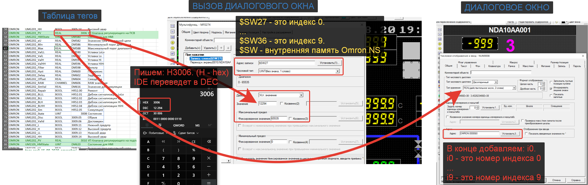
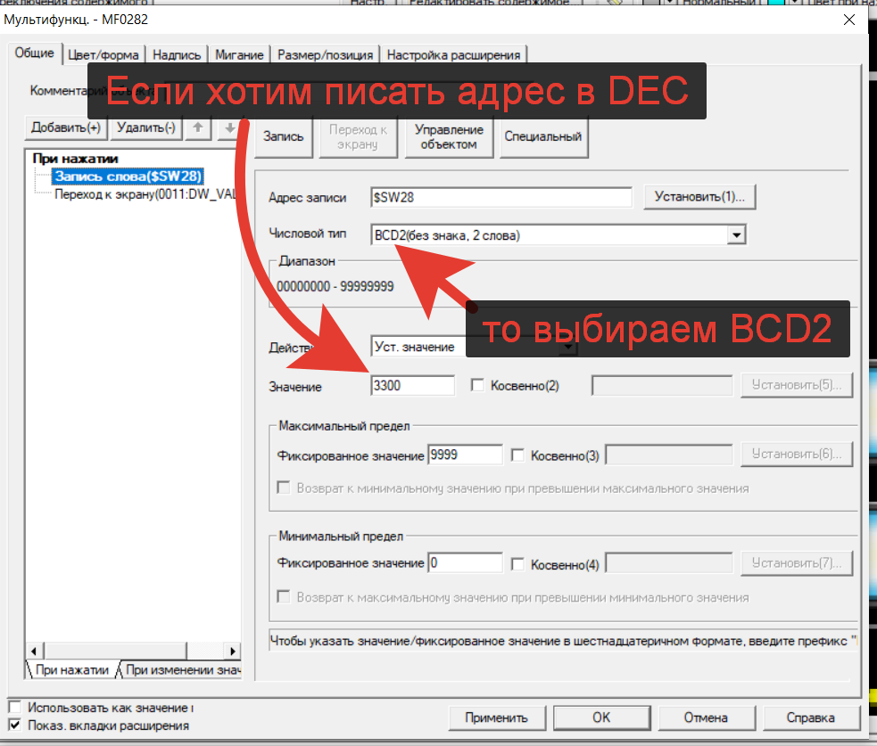
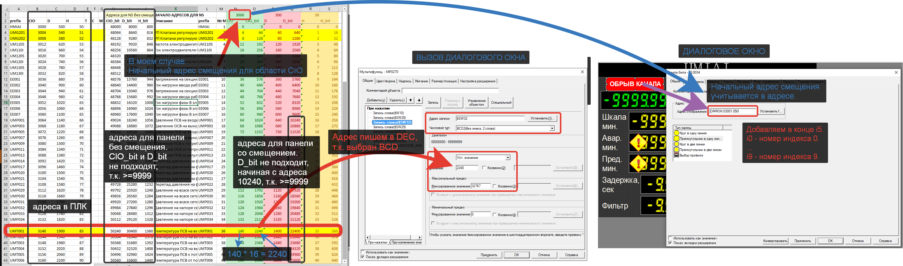

# Индексная адресация (INDEX)

- [Ограничения при работе с индексами](#%D0%9E%D0%B3%D1%80%D0%B0%D0%BD%D0%B8%D1%87%D0%B5%D0%BD%D0%B8%D1%8F-%D0%BF%D1%80%D0%B8-%D1%80%D0%B0%D0%B1%D0%BE%D1%82%D0%B5-%D1%81-%D0%B8%D0%BD%D0%B4%D0%B5%D0%BA%D1%81%D0%B0%D0%BC%D0%B8)
	- [Ограничен адрес](#%D0%9E%D0%B3%D1%80%D0%B0%D0%BD%D0%B8%D1%87%D0%B5%D0%BD-%D0%B0%D0%B4%D1%80%D0%B5%D1%81)
	- [Соблюдать последовательность использования индексов](#%D0%A1%D0%BE%D0%B1%D0%BB%D1%8E%D0%B4%D0%B0%D1%82%D1%8C-%D0%BF%D0%BE%D1%81%D0%BB%D0%B5%D0%B4%D0%BE%D0%B2%D0%B0%D1%82%D0%B5%D0%BB%D1%8C%D0%BD%D0%BE%D1%81%D1%82%D1%8C-%D0%B8%D1%81%D0%BF%D0%BE%D0%BB%D1%8C%D0%B7%D0%BE%D0%B2%D0%B0%D0%BD%D0%B8%D1%8F-%D0%B8%D0%BD%D0%B4%D0%B5%D0%BA%D1%81%D0%BE%D0%B2)
- [Работа с числами](#%D0%A0%D0%B0%D0%B1%D0%BE%D1%82%D0%B0-%D1%81-%D1%87%D0%B8%D1%81%D0%BB%D0%B0%D0%BC%D0%B8)
- [Работа с битами](#%D0%A0%D0%B0%D0%B1%D0%BE%D1%82%D0%B0-%D1%81-%D0%B1%D0%B8%D1%82%D0%B0%D0%BC%D0%B8)
- [Файл для примера](#%D0%A4%D0%B0%D0%B9%D0%BB-%D0%B4%D0%BB%D1%8F-%D0%BF%D1%80%D0%B8%D0%BC%D0%B5%D1%80%D0%B0)

## Ограничения при работе с индексами

### Ограничение адресов

>[!warning] Итоговый адрес после смещения должен быть **меньше либо равен ≤9999**.

Данное ограничение имеет несколько взаимосвязанных причин.

1. Значение индекса представлено 16 bit. Это означает, что максимальное значение в индекс мы можем записать 2^16-1=65535.
2. Адрес мы записываем в формате BCD. Если BCD занимает 1 word (16bit), то максимальное значение мы получим 9999. Если BCD занимает 2 word (32bit), то максимальное значение мы получим 99999999.
3. Итого. Если мы напишем значение адреса больше 9999 (> 9999) в формате BCD, то произойдет переполнение значения индекса.

Как вариант решения проблемы, это изменение стартового адреса для смещения.

Например, если адреса идут CIO3000, CIO3020, CIO3030, …, то стартовый адрес можно взять CIO3000 и смещение указывать 0, 20, 30, … в формате BCD.

### Последовательность использования индексов

При привязке индексов нужно соблюдать последовательность применения, от меньшего адреса индекса к большему.

## Работа с числами

## Работа с битами

Адрес слова в котором содержится нужный бит(ы) записывается в формате BCD и **еще должен быть умножен на 16**. Это связано с тем, что значение индекса в данном случае будет содержать количество бит на которое нужно сместить стартовый адрес.

Например, адрес **H4.05**. Мы принимаем стартовый адрес за **H0.00** и записываем **смещение 64**, т.к. `0 + 4 * 16 = 64`. Мы должны добавить 64 бита к стартовому адресу H0.00, чтобы получить H4.00. Номер бита **HR00000.05i1** указываем в диалоговом окне, где **i1** - это номер индекса (**i0** … **i9**).

## Файл для примера

Файл *NS_HMI_obj_example.xlsx* состоит из вкладок:

- **omronhmi** - содержит теги для импорта в HMI (можно не использовать).
- **obj_rev4** - содержит стартовые (начальные адреса) структур.
- **common_template** - содержит состав структур с указанием смещения тегов.

