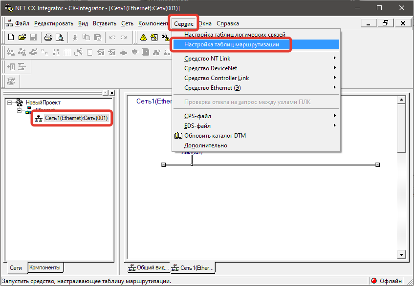
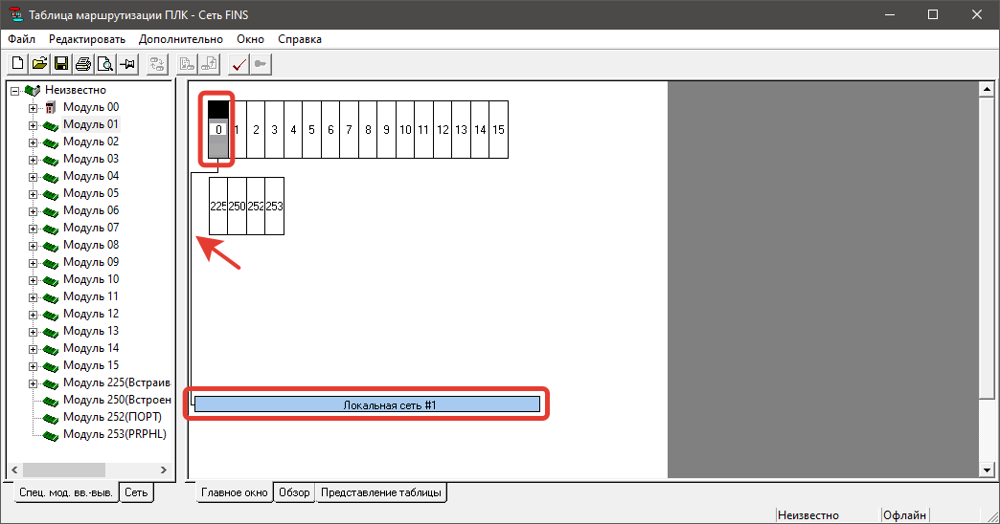
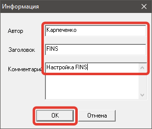

# Подключение панели NS по FINS к ПЛК CS с модулями CS1D-ETN21D

- [Общее описание](#%D0%9E%D0%B1%D1%89%D0%B5%D0%B5-%D0%BE%D0%BF%D0%B8%D1%81%D0%B0%D0%BD%D0%B8%D0%B5)
	- [Оборудование](#%D0%9E%D0%B1%D0%BE%D1%80%D1%83%D0%B4%D0%BE%D0%B2%D0%B0%D0%BD%D0%B8%D0%B5)
	- [Задача](#%D0%97%D0%B0%D0%B4%D0%B0%D1%87%D0%B0)
	- [Схема сети](#%D0%A1%D1%85%D0%B5%D0%BC%D0%B0-%D1%81%D0%B5%D1%82%D0%B8)
- [Настройка панелей HMI в CX-Designer](#%D0%9D%D0%B0%D1%81%D1%82%D1%80%D0%BE%D0%B9%D0%BA%D0%B0-%D0%BF%D0%B0%D0%BD%D0%B5%D0%BB%D0%B5%D0%B9-hmi-%D0%B2-cx-designer)
	- [Настройка панели **HMI1**](#%D0%9D%D0%B0%D1%81%D1%82%D1%80%D0%BE%D0%B9%D0%BA%D0%B0-%D0%BF%D0%B0%D0%BD%D0%B5%D0%BB%D0%B8-%D0%BF%D0%BE%D0%B7-hmi1)
	- [Настройка модуля **ETN1**](#%D0%9D%D0%B0%D1%81%D1%82%D1%80%D0%BE%D0%B9%D0%BA%D0%B0-%D0%BC%D0%BE%D0%B4%D1%83%D0%BB%D1%8F-%D0%BF%D0%BE%D0%B7-etn1)
	- [Настройка модуля **ETN2**](#%D0%9D%D0%B0%D1%81%D1%82%D1%80%D0%BE%D0%B9%D0%BA%D0%B0%C2%A0%D0%BC%D0%BE%D0%B4%D1%83%D0%BB%D1%8F-%D0%BF%D0%BE%D0%B7-etn2)
- [Настройка сети в CX-Integrator](#%D0%9D%D0%B0%D1%81%D1%82%D1%80%D0%BE%D0%B9%D0%BA%D0%B0-%D1%81%D0%B5%D1%82%D0%B8-%D0%B2-cx-integrator)
- [## Настройка таблицы маршрутизации](#-%D0%9D%D0%B0%D1%81%D1%82%D1%80%D0%BE%D0%B9%D0%BA%D0%B0-%D1%82%D0%B0%D0%B1%D0%BB%D0%B8%D1%86%D1%8B-%D0%BC%D0%B0%D1%80%D1%88%D1%80%D1%83%D1%82%D0%B8%D0%B7%D0%B0%D1%86%D0%B8%D0%B8)
	- [Создание FINS сети с адресом 1](#%D0%A1%D0%BE%D0%B7%D0%B4%D0%B0%D0%BD%D0%B8%D0%B5-fins-%D1%81%D0%B5%D1%82%D0%B8-%D1%81-%D0%B0%D0%B4%D1%80%D0%B5%D1%81%D0%BE%D0%BC-1)
	- [Создание FINS сети с адресом 2](#%D0%A1%D0%BE%D0%B7%D0%B4%D0%B0%D0%BD%D0%B8%D0%B5-fins-%D1%81%D0%B5%D1%82%D0%B8-%D1%81-%D0%B0%D0%B4%D1%80%D0%B5%D1%81%D0%BE%D0%BC-2)
	- [Загрузка настроек в контроллер](#%D0%97%D0%B0%D0%B3%D1%80%D1%83%D0%B7%D0%BA%D0%B0-%D0%BD%D0%B0%D1%81%D1%82%D1%80%D0%BE%D0%B5%D0%BA-%D0%B2-%D0%BA%D0%BE%D0%BD%D1%82%D1%80%D0%BE%D0%BB%D0%BB%D0%B5%D1%80)
- [Исходные файлы](#%D0%98%D1%81%D1%85%D0%BE%D0%B4%D0%BD%D1%8B%D0%B5-%D1%84%D0%B0%D0%B9%D0%BB%D1%8B)

## Общее описание

### Оборудование

Есть контроллер **OMRON CS1D-CPU65H** с двумя коммуникационными модулями **CS1D-ETN21D** и две панели **OMRON NS15**.

### Задача

1. Первую панель **HMI1** подключить к основному интерфейсному модулю **ETN1** контроллера, а вторую панель **HMI2** ко второму модулю **ETN2**.
2. Настроить обмен данными между контроллером и панелями.

>[!warning] Я не включал на модулях **CS1D-ETN21D** режим **duplex**. Настройку **duplex** режима см. [CS. Настройка Duplex Ethernet](472312.html).
>**Теорию не проверял**! В теории, если включить на модулях **CS1D-ETN21D** режим **duplex**, то можно обойтись одной FINS сетью.

### Схема сети

Предположим, что две сети ethernet изолированы друг от друга и будут иметь следующий вид.

## Настройка панелей HMI в CX-Designer

На вкладке **Система** откройте окно **Связь Настройка**.

На вкладке **Ethernet** включите интерфейс **Ethernet** и установите следующие параметры.

>[!warning]
>Панели **OMRON** серии **NSxx** должны иметь **сетевой адрес** (номер/адрес FINS сети) в пределах **1 … 127**. В локальной сети с номером **0**, работать не умеют.

>[!warning]
>Если **последний октет IP адреса** контроллера или панели больше **126** (подробнее см. [Протокол FINS](505795.html)), то используйте **таблицу преобразований** (**таблицу адресов**) для сопоставления номера FINS узла с IP-адресом. Например, IP адрес контроллера 192.168.12.**240**, маска подсети 255.255.255.0, то узел FINS можно назначить **40** или любое другое число (1…126), которое уникальное в рамкам одной FINS сети.

|**Позиция панели**|**HMI1**|**HMI2**|**Примечание**|
|---|---|---|---|
|Заказной номер|NS15-TS01B-V2|NS15-TS01B-V2||
|Ethernet|Включен|Включен||
|Сетевой адрес|1|2|Номер FINS сети|
|Адрес узла|31|31|Номер FINS узла|
|№ порта UDP|9621|9621||
|IP адрес|192.168.50.31|192.168.51.31||
|Маска подсети|255.255.255.0|255.255.255.0||
|Шлюз по умолчанию|0.0.0.0|0.0.0.0||
|IP адрес прокси|0.0.0.0|0.0.0.0||

>[!info] Сетевые настройки панели и настройки подключения к контроллеру можно изменить через системное меню панели. Подробнее см. [NS. Открытие системного меню](472269.html).

### Настройка панели **HMI1**

### Настройка панели **HMI2**

## Настройка контроллера в CX-Programmer

Расположение интерфейсных модулей **CS1D-ETN21D** в главной стойке.

>[!warning]
>Если в сети ethernet присутствует или планируется использовать несколько контроллеров OMRON, то рекомендую назначить им **уникальные** номера портов. Обычно, чтобы запоминать номер порта, я беру комбинацию **9600** + **последний октет IP**. Например, 9600 + 21 = 9621.

|**Позиция модуля**|**ETN1**|**ETN2**|**Примечание**|
|---|---|---|---|
|Заказной номер|CS1D-ETN1D|CS1D-ETN1D||
|Номер слота в стойке|03|04|Нумерация начинается с 0|
|Номер модуля|0|1||
|IP-адрес|192.168.50.21|192.168.51.21||
|Маска подсети|255.255.255.0|255.255.255.0||
|Порт FINS/UDP|9621|9621||
|Порт FINS/UDP|9621|9621||

### Настройка модуля **ETN1**

### Настройка модуля **ETN2**

## Настройка сети в CX-Integrator

>[!warning] Я не уверен, что шаги из данного раздела нужно выполнять, но я выполнял. Можно сразу перейти к следующему разделу.

В навигаторе CX-Programmer **выделите ПЛК**, перейдите в меню **Сервис** - **Параметры сети**.

Если у вас появилась сеть **NTLink** или другая (не Ethernet), то удалите ее. Для этого нажмите правой кнопкой мыши по сети и в контекстном меню выберите **Удалить**.

Подтвердите кнопкой **Да**.

Нажмите правой кнопкой мыши по названию проекта и выберите **Вставить сеть**.

Выберите **Ethernet** (Ethernet(**FINS**)) и нажмите **Далее**.

**Адрес сети** установите **1** и нажмите **Готово**.

>[!info]
>**Адрес сети** - это адрес сети FINS. Данный номер будет использоваться во время настройки панели **HMI1**.

В навигаторе **Сети** выделите только, что созданную сеть и нажмите кнопку **Вставить компонент**.

Выберите **PLC** и нажмите **Далее**.

Выберите **ЦПУ** вашего контроллера и нажмите **Далее**.

Убедитесь, что тип сети **Ethernet**, адрес **1** и нажмите **Далее**.

Выберите тип модуля **CS1D-ETN21D** и нажмите **Далее**.

Выберите **Номер модуля 00** и нажмите **Далее**.

>[!warning]
>Номер модуля **00** должен соответствовать номеру модуля:
>- в таблице **Ввода/Вывода** напротив Ethernet модулей в CX-Programmer
>- и крутелке **UNIT No.** на самом (физическом) модуле.

В поле **Узел** установите номер **21** и нажмите **Готово**. 

>[!info]
>**Узел** - это адрес FINS узла.

>[!warning]
>Если **последний октет IP адреса** контроллера или панели больше **126** (подробнее см. [Протокол FINS](505795.html)), то используйте **таблицу преобразований** (**таблицу адресов**) для сопоставления номера FINS узла с IP-адресом. Например, IP адрес контроллера 192.168.12.**240**, маска подсети 255.255.255.0, то узел FINS можно назначить **40** или любое другое число (1…126), которое уникальное в рамкам одной FINS сети.

**Убедитесь**, что в сети Ethernet появился контроллер с назначенным узлом.

**Сохраните** полученный проект.

## ## Настройка таблицы маршрутизации

>[!warning]
>Во время написания заметки у меня не было контроллера. Некоторые скриншоты могут отличаться.

Перейдите в режим **Онлайн** (подключитесь к контроллеру). Для этого нажмите желтую иконку **Работать в режиме онлайн**.

Чтобы проверить настройки подключения нажмите **Настройки связи**.

Выберите тип сети **Ethernet (FINS/TCP)** и нажмите **Настройки**.

На вкладке **Сеть** оставьте все по умолчанию.

На вкладке **Драйвер** установите IP-адрес **192.168.50.21** модуля **ETN1** контроллера, выставьте порт **9621** и нажмите **ОК**.

>[!warning]
>**IP-адрес** и **номер порта** должны совпадать с настройками модуля **ETN1**.

Нажмите **ОК**.

Нажмите **Запуск таблицы маршрутизации**.

У меня нет ПЛК поэтому я получил ошибку

Таблицу маршрутизации можно открыть через меню **Сервис**. Выделите нужную сеть, нажмите **Сервис** - **Настройка таблиц маршрутизации**.

Выберите **Сеть FINS** и нажмите **ОК**.

### Создание FINS сети с адресом 1

Нажмите правой кнопкой мыши по **Модуль 00** и выберите **Вставить спец. мод. вв.-выв. ЦПУ**.

>[!warning] Номер модуля **00** должен соответствовать номеру модуля:
>- в таблице **Ввода/Вывода** напротив Ethernet модуля в CX-Programmer (**ETN1**)
>- и крутелке **UNIT No.** на самом (физическом) модуле.

В пункте **Номер локальной сети** установите **1** и нажмите О**К**.

>[!info] **Номер локальной сети =1** - это адрес сети FINS для панели **HMI1**.

Убедитесь, что **Модуль 00** подключен к сети **Локальная сеть #1**.

### Создание FINS сети с адресом 2

Нажмите правой кнопкой мыши по **Модуль 01** и выберите **Вставить спец. мод. вв.-выв. ЦПУ**.

>[!warning]
>Номер модуля **01** должен соответствовать номеру модуля:
>- в таблице **Ввода/Вывода** напротив Ethernet модуля в CX-Programmer (**ETN2**)
>- и крутелке **UNIT No.** на самом (физическом) модуле.

В пункте **Номер локальной сети** установите **2** и нажмите **ОК**.

>[!info] **Номер локальной сети =2** - это адрес сети FINS для панели **HMI2**.

Убедитесь, что **Модуль 01** подключен к сети **Локальная сеть #2**.

### Загрузка настроек в контроллер

На вкладке **Представление таблицы** в группе **Локальная сеть** убедитесь, что:
* **0** номер спец. мод. вв.-выв. “смотрит” в **1** локальную сеть,
* **1** номер спец. мод. вв.-выв. “смотрит” в **2** локальную сеть.

Загрузите настройки в контроллер. В меню **Дополнительно** нажмите **Загрузить на ПЛК**.

**Сохраните** проект.

Введите свои комментарии и нажмите **ОК**.

## Исходные файлы

