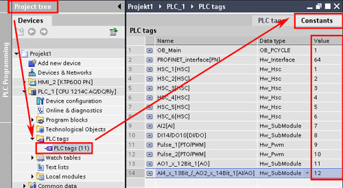
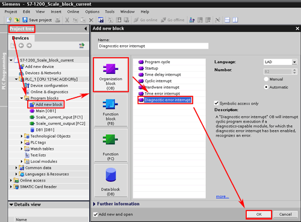

# Диагностика каналов ввода-вывода в S7-1200, S7-1500

>[!error] ЗАМЕТКА НЕ ДОПИСАНА!!! ИНФОРМАЦИЮ СМОТРИ В ИСТОЧНИКАХ

- [Источники](#%D0%98%D1%81%D1%82%D0%BE%D1%87%D0%BD%D0%B8%D0%BA%D0%B8)

С помощью диагностических событий можно обнаружить следующие ошибки:
- Отсутствует питание (No user power)
- Превышен верхний предел (High limit exceeded)
- Превышен нижний предел (Low limit exceeded)
- Обрыв провода (Wire break)
- Короткое замыкание (Short circuit)

Когда на вкладках **Device** **view** или **Network view** добавляются компоненты (ЦПУ, модули, Profinet устройства и т.д.) автоматически назначаются идентификаторы оборудования **HW-ID**. Идентификатор оборудования **HW-ID** можно найти на вкладке **Constants** в **PLC tag**.

Для анализа **HW-ID** используйте организационный блок **OB82 "Diagnostic error interrupt"**.

Для **S7-1200** описание входов блока **OB82** **"Diagnostic error interrupt"** представлено ниже.

| **Вход**       | **Тип данных** | **Описание** |
| ---------- | ---------- | -------- |
| **IOstate**    | WORD           | **Bit 0**: Configuration correct **Bit 4**: Error (for example a wire break) **Bit 5**: Configuration not correct **Bit 6**: I/O cannot be accessed|
| **LADDR**      | HW_ANY         | Аппаратный идентификатор **HW-ID** устройства или функционального блока, сообщившего об ошибке |
| **Channel**    | UINT           | Номер канала |
| **MultiError** | BOOL           | **TRUE**, если присутствует более одной ошибки |

Для **S7-1500** описание входов блока **OB82** **"Diagnostic error interrupt"** представлено ниже.

| **Вход**       | **Тип данных** | **Описание** |
| ---------- | ---------- | -------- |
| **IOstate**    | WORD           | **Bit 0**: Good **Bit 1**: Deactivated **Bit 2**: Maintenance required **Bit 3**: Maintenance demanded **Bit 4**: Error (for example a wire break) **Bit 5**: Not available **Bit 6**: Qualified **Bit 7**: Not available **Bit 8 to 14**: Reserved (always 0) **Bit 15**: Network/Hardware fault: If **Bit 4** = 1 or **Bit 5** = 1: - **Bit 15** = 0: Network error - **Bit 15** = 1: Hardware error|
| **LADDR**      | HW_ANY         | Аппаратный идентификатор **HW-ID** устройства или функционального блока, сообщившего об ошибке |
| **Channel**    | UINT           | Номер канала |
| **MultiError** | BOOL           | **TRUE**, если присутствует более одной ошибки |

## Источники

1. [SIOS. How can you use an analog current output with wire break diagnostics on your S7-1200 PLC?](https://support.industry.siemens.com/cs/document/42320122/how-can-you-use-an-analog-current-output-with-wire-break-diagnostics-on-your-s7-1200-plc-?dti=0&lc=en-WW)
2. [How do you diagnose IO access errors with the S7-1200?](https://support.industry.siemens.com/cs/document/42781105/how-do-you-diagnose-io-access-errors-with-the-s7-1200-?dti=0&dl=en&lc=tr-TR)
3. [SIOS. SIMATIC S7 S7-1200 Programmable controller. Diagnostic error interrupt OB](https://support.industry.siemens.com/cs/mdm/107623221?c=70491858187&lc=en-BE)
4. [Tips for Diagnose in S7-1200 user program - 43759 - Industry Support Siemens](https://support.industry.siemens.com/forum/WW/en/posts/tips-for-diagnose-in-s7-1200-user-program/43759)
5. [TIA Portal: OB82 - Diagnostic Error Interrupt Part 1/2 - YouTube](https://www.youtube.com/watch?v=bEkD6CMB6n4)
6. [TIA Portal: OB82 - Diagnostic Error Interrupt Part 2/2 - YouTube](https://www.youtube.com/watch?v=BrbIEU2i0qc)