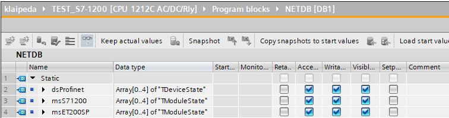

# Диагностика сети Profinet и модулей в S7-1200, S7-1500

- [Введение](#%D0%92%D0%B2%D0%B5%D0%B4%D0%B5%D0%BD%D0%B8%D0%B5)
- [Состав оборудования](#%D0%A1%D0%BE%D1%81%D1%82%D0%B0%D0%B2-%D0%BE%D0%B1%D0%BE%D1%80%D1%83%D0%B4%D0%BE%D0%B2%D0%B0%D0%BD%D0%B8%D1%8F)
- [Подготовительные действия](#%D0%9F%D0%BE%D0%B4%D0%B3%D0%BE%D1%82%D0%BE%D0%B2%D0%B8%D1%82%D0%B5%D0%BB%D1%8C%D0%BD%D1%8B%D0%B5-%D0%B4%D0%B5%D0%B9%D1%81%D1%82%D0%B2%D0%B8%D1%8F)
	- [Создание пользовательских типов данных](#%D0%A1%D0%BE%D0%B7%D0%B4%D0%B0%D0%BD%D0%B8%D0%B5-%D0%BF%D0%BE%D0%BB%D1%8C%D0%B7%D0%BE%D0%B2%D0%B0%D1%82%D0%B5%D0%BB%D1%8C%D1%81%D0%BA%D0%B8%D1%85-%D1%82%D0%B8%D0%BF%D0%BE%D0%B2-%D0%B4%D0%B0%D0%BD%D0%BD%D1%8B%D1%85)
	- [Наполнение блока данных](#%D0%9D%D0%B0%D0%BF%D0%BE%D0%BB%D0%BD%D0%B5%D0%BD%D0%B8%D0%B5-%D0%B1%D0%BB%D0%BE%D0%BA%D0%B0-%D0%B4%D0%B0%D0%BD%D0%BD%D1%8B%D1%85)
- [Диагностика сети Profinet](#%D0%94%D0%B8%D0%B0%D0%B3%D0%BD%D0%BE%D1%81%D1%82%D0%B8%D0%BA%D0%B0-%D1%81%D0%B5%D1%82%D0%B8-profinet)
	- [Определение hardware номера сети Profinet](#%D0%9E%D0%BF%D1%80%D0%B5%D0%B4%D0%B5%D0%BB%D0%B5%D0%BD%D0%B8%D0%B5-hardware-%D0%BD%D0%BE%D0%BC%D0%B5%D1%80%D0%B0-%D1%81%D0%B5%D1%82%D0%B8-profinet)
	- [Написание кода](#%D0%9D%D0%B0%D0%BF%D0%B8%D1%81%D0%B0%D0%BD%D0%B8%D0%B5-%D0%BA%D0%BE%D0%B4%D0%B0)
	- [Тестирование сети](#%D0%A2%D0%B5%D1%81%D1%82%D0%B8%D1%80%D0%BE%D0%B2%D0%B0%D0%BD%D0%B8%D0%B5-%D1%81%D0%B5%D1%82%D0%B8)
	- [Источники](#%D0%98%D1%81%D1%82%D0%BE%D1%87%D0%BD%D0%B8%D0%BA%D0%B8)
- [Диагностика модулей ввода-вывода](#%D0%94%D0%B8%D0%B0%D0%B3%D0%BD%D0%BE%D1%81%D1%82%D0%B8%D0%BA%D0%B0-%D0%BC%D0%BE%D0%B4%D1%83%D0%BB%D0%B5%D0%B9-%D0%B2%D0%B2%D0%BE%D0%B4%D0%B0-%D0%B2%D1%8B%D0%B2%D0%BE%D0%B4%D0%B0)
	- [Определение hardware номеров устройств](#%D0%9E%D0%BF%D1%80%D0%B5%D0%B4%D0%B5%D0%BB%D0%B5%D0%BD%D0%B8%D0%B5-hardware-%D0%BD%D0%BE%D0%BC%D0%B5%D1%80%D0%BE%D0%B2-%D1%83%D1%81%D1%82%D1%80%D0%BE%D0%B9%D1%81%D1%82%D0%B2)
	- [Написание кода](#%D0%9D%D0%B0%D0%BF%D0%B8%D1%81%D0%B0%D0%BD%D0%B8%D0%B5-%D0%BA%D0%BE%D0%B4%D0%B0)
	- [Тестирование модулей](#%D0%A2%D0%B5%D1%81%D1%82%D0%B8%D1%80%D0%BE%D0%B2%D0%B0%D0%BD%D0%B8%D0%B5-%D0%BC%D0%BE%D0%B4%D1%83%D0%BB%D0%B5%D0%B9)
	- [Источники](#%D0%98%D1%81%D1%82%D0%BE%D1%87%D0%BD%D0%B8%D0%BA%D0%B8)
- [Сравнение времен цикла контроллера](#%D0%A1%D1%80%D0%B0%D0%B2%D0%BD%D0%B5%D0%BD%D0%B8%D0%B5-%D0%B2%D1%80%D0%B5%D0%BC%D0%B5%D0%BD-%D1%86%D0%B8%D0%BA%D0%BB%D0%B0-%D0%BA%D0%BE%D0%BD%D1%82%D1%80%D0%BE%D0%BB%D0%BB%D0%B5%D1%80%D0%B0)
- [Приложения](#%D0%9F%D1%80%D0%B8%D0%BB%D0%BE%D0%B6%D0%B5%D0%BD%D0%B8%D1%8F)

## Введение

С помощью функции **DeviceStates** можно произвести диагностику сетей **Profinet** и **Profibus**. 
С помощью функции **ModuleStates** можно произвести диагностику **ЦПУ**, **периферии** и **модулей** ввода-вывода.

## Состав оборудования

Состав оборудования над которым будем проводить опыты.

| **Оборудование** | **Модуль** | **Примечание** |
| --- | --- | --- |
| Контроллер S7-1200 | Аналоговые входы<br>SM 1231 AI4 TC<br>SM 1231 AI4 |
| Контроллер ET 200SP | Без модулей | Выступает в роли периферии [Подробнее](https://support.industry.siemens.com/cs/document/109744406/configure-cp-343-1-as-a-profinet-i-device-in-step-7-(tia-portal)?dti=0&dl=en&lc=sk-SK) |


## Подготовительные действия

### Создание пользовательских типов данных

Создайте пользовательские типы данных **TDeviceState** и **TModuleState** для удобства диагностики. 


Тип данных **TDeviceState** для диагностики Profinet сети:

| **Name** | **Data type** | **Comment** |
| ---- | ---- | ---- |
| **Laddr** |  HW_IOSYSTEM | Номер hardware profinet IO сети |
| **Mode** |  UInt | Режим диагностики:<br>1 - Сконфигурировано<br>2 - Неисправно<br>3 - Отключено<br>4 - Доступно (в сети)<br>5 - В ошибке|
| **RetVal** |  Int | Код ошибки (0 - ошибок нет) |
| **State** |  Array[0..63] of Bool | Состояние устройств (номер бита соответствует номеру устройства (**Device number**) в сети) |

Тип данных **TModuleState** для диагностики модулей:

| **Name** | **Data type** | **Comment** |
| ---- | ---- | ---- |
| **Laddr** |  HW_DEVICE | Номер hardware ЦПУ/Периферии |
| **Mode** |  UInt | Режим диагностики:<br>1 - Сконфигурировано<br>2 - Неисправно<br>3 - Отключено<br>4 - Доступно (в сети)<br>5 - В ошибке|
| **RetVal** |  Int | Код ошибки (0 - ошибок нет) |
| **State** |  Array[0..15] of Bool | Состояние модулей (номер бита соответствует номеру слота (**Slot**) в стойке) |

### Наполнение блока данных

Создайте блок данных для хранения диагностической информации. В моем случае  данные будут размещены в блоке **DB1**.
Для диагностики сети Profinet создайте один массив с пятью элементами **TDeviceState**.
Затем для каждого устройства в сети Profinet создайте массивы с пятью элементами **TModuleState**. Каждому элементу массива будет соответствует определенный режим аппаратной диагностики (**Mode**).



| **Name** | **Data type** | **Comment** |
| ---- | ---- | ---- |
| **dsProfinet** |  Array[0..4 of "TDeviceState"] | Сеть Profinet |
| **msS71200** |  Array[0..4 of "TModuleState"] | Контроллер S7-1200 (с 2 модулями) |
| **msET200SP** |  Array[0..4 of "TModuleState"] | Периферия ET 200SP (без модулей)|

## Диагностика сети Profinet

### Определение hardware номера сети Profinet

Сперва определим hardware сети Profinet. Для этого на вкладке **Device configuration** > **Network view** дважды щелкните по Profinet сети. На вкладке **General** в меню **Hardware identifier** запомните номер. Затем на вкладке **System constant** найдите константу с найденным значением. У константы должен быть тип данных **Hw_IoSystem**. Она нам пригодится при написании скрипта.


### Написание кода

В контроллере создайте **FC** блок на языке **SCL**. В моем случае функция **FC1**. Для аппаратной диагностики нам понадобится системная функция **DeviceStates**. Она размещена в разделе **Extended instructions** > **Diagnostics**.


Скорректируйте текст скрипта исходя из своего состава оборудования и названий констант, которые были определены на предыдущих шагах. Скрипт в цикле пробегается по всем доступным режимам диагностики и сохраняет данные в DB. 


```
(* Диагностика сети Profinet *)
FOR #i := 0 TO 4 DO
    "NETDB".dsProfinet[#i].Laddr := "Local~PROFINET_IO-System";
    "NETDB".dsProfinet[#i].Mode := INT_TO_UINT(#i + 1);
    "NETDB".dsProfinet[#i].RetVal := DeviceStates(
	    LADDR := "NETDB".dsProfinet[#i].Laddr,
	    MODE := "NETDB".dsProfinet[#i].Mode,
        STATE := "NETDB".dsProfinet[#i].State);
END_FOR;
```

В организационном блоке **OB1** вызывайте созданную функцию один раз в секунду. Полученную программу загрузите в контроллер. 


> [!error]
> У меня не вызывался блок диагностического прерывания **OB82** (diagnostic interrupt) при обрыве связи Profinet, поэтому использую **OB1**.  Предполагаю (не проверял), чтобы сработал блок **OB82** необходимо собрать топологию на вкладке **Topology view**. Однако и там есть нюансы.

### Тестирование сети

>[!info] 
>Каждое устройство в сети имеет номер **Device number**. Его можно найти на вкладке **Device configuration** > **Network view** в колонке **Device number**.

Когда периферия в сети, то в 4 режиме диагностики  (**Mode** = 4) в массиве **State** бит соответствующий **Device number** установлен в **TRUE**.  


Если выдернуть сетевой кабель, то периферия станет офлайн (не в сети) и бит установится в **FALSE**.  


### Источники

- [Контроль присутствия устройств в сети PROFINET или PROFIBUS для S7-1200 и S7-1500](https://www.maxplant.ru/article/siemens_tutorial_13.php).
- Справка для функцию [DeviceStates](файлы/Справка%20DeviceStates.pdf).

## Диагностика модулей ввода-вывода

### Определение hardware номеров устройств

На вкладке **Device configuration** > **Network view** выберите контроллер. Затем на вкладке **System constants** найдите константу c типом данных **Hw_Device**. Она нам пригодится при написании скрипта.


Выберите другое устройство и вкладке **System constants** найдите константу c типом данных **Hw_Device**. Обратите внимание, чтобы выбранное устройство использовалось контроллером. В моем случае основной контроллер **TEST_S7-1200**. 


### Написание кода

В контроллере создайте **FC** блок на языке **SCL**. В моем случае функция **FC1**. Для аппаратной диагностики нам понадобится системная функция **ModuleStates**. Она размещена в разделе **Extended instructions** > **Diagnostics**.


Скорректируйте текст скрипта исходя из своего состава оборудования и названий констант, которые были определены на предыдущих шагах.


```
(* Диагностика модулей контроллера S7-1200 *)
FOR #i := 0 TO 4 DO
    "NETDB".msS71200[#i].Laddr := "Local~Device";
    "NETDB".msS71200[#i].Mode := INT_TO_UINT(#i + 1);
    "NETDB".msS71200[#i].RetVal := ModuleStates(
	    LADDR := "NETDB".msS71200[#i].Laddr,
        MODE := "NETDB".msS71200[#i].Mode,
        STATE := "NETDB".msS71200[#i].State);
END_FOR;

(* Диагностика модулей периферии ET 200SP *)
FOR #i := 0 TO 4 DO
    "NETDB".msET200SP[#i].Laddr := "TEST_ET200SP~PROFINET_interface_1~IODevice";
    "NETDB".msET200SP[#i].Mode := INT_TO_UINT(#i + 1);
    "NETDB".msET200SP[#i].RetVal := ModuleStates(
	    LADDR := "NETDB".msET200SP[#i].Laddr,
        MODE := "NETDB".msET200SP[#i].Mode,
        STATE := "NETDB".msET200SP[#i].State);
END_FOR;
```

В организационном блоке **OB1** вызывайте созданную функцию один раз в секунду. Полученную программу загрузите в контроллер. 


### Тестирование модулей

Обратите внимание на модуль в слоте 2. С ним все в порядке, горит зеленая галочка. Во 2 или 5 режиме диагностики (**Mode** = 2 или 5) в массиве  **State** третий бит установлен в **FALSE**.


Если снять внешнее питание с модуля или произвести обрыв канала (при условии, что включена диагностика обрыва канала), то на модуле появится ошибка. Бит установится в **TRUE**.


### Источники

- [Identifying Topology Mismatch in Logic](https://www.dmcinfo.com/latest-thinking/blog/id/9841/identifying-topology-mismatch-in-logic).
- Справка для функцию [ModuleStates](файлы/Справка%20ModuleStates.pdf).

## Сравнение времен цикла контроллера

В организационном блоке **OB1** вызывайте созданную функцию один раз в секунду для снижения нагрузки на ЦПУ. На [рисунке](файлы/Pasted%20image%2020231202215055.png) ниже отображены времена циклов работы контроллера:


- слева: **1мс** - без диагностики.
- по центру: ==**13мс**== - диагностика выполняется каждый цикл **OB1**.
- справа: **1..2мс** - диагностика выполняется один раз в секунду в **OB1**.

## Приложения

- [Проект](файлы/Diag_checking_2023.11.27.zap17) на TIA Portal V17.

